# SAP BDC Datasphere Partner Workshop 2025

SAP Korea BDC 파트너 워크샵 — SAP Datasphere 핸즈온 실습 교육 자료

---

## 워크샵 개요

| 항목 | 내용 |
|------|------|
| 일시 | 2025년 5월 19일 (월) |
| 대상 | SAP Korea BDC 파트너 |
| 형태 | 1-Day 핸즈온 워크샵 |
| 주제 | SAP Datasphere 데이터 모델링 실습 (S/4HANA SD 시나리오) |

---

## 교육 환경

| 항목 | 정보 |
|------|------|
| Datasphere 테넌트 | https://poc-dsp-1.ap12.hcs.cloud.sap/ |
| 연결 S/4HANA | HE4 (S/4HANA On-Premise) |
| 커넥션 ID | `HE4_S4H` |
| 표준 컨텐츠 패키지 | `BCT_SD` (SD 표준 분석 컨텐츠 한글화) |

---

## 참가자 계정 정보

각 참가자는 개인 전용 Space와 계정이 할당됩니다.

| 계정 | 비밀번호 |
|------|---------|
| `sap.dsp.ws.kr+xx@gmail.com` | 

클릭하여 확인
`Welcome1!`
 |

> 첫 로그인 시 비밀번호를 변경하시기 바랍니다.

---

## 워크샵 어젠다

```mermaid
gantt
    title Workshop Agenda — 2025-05-19
    dateFormat HH:mm
    axisFormat %H:%M

    section 오전
    등록 및 환경 확인                       : 09:00, 30m
    오프닝 - SAP BDC & Datasphere 개요      : 09:30, 30m
    전체 아키텍처 및 시나리오 설명           : 10:00, 30m
    Lab 1. BCT_SD 패키지 Import             : 10:30, 30m
    Lab 2. Replication Flow 데이터 적재     : 11:00, 30m
    Lab 3. 표준 Analytic Model 데이터 확인  : 11:30, 30m

    section 점심
    점심                                    : 12:00, 60m

    section 오후
    가상 고객 요건 Review                   : 13:00, 30m
    Lab 4-A. ODP 기반 Fact View & AM        : 13:30, 90m
    Lab 4-B. CDS View 기반 Fact View & AM   : 15:00, 90m
    Q&A 및 클로징                           : 16:30, 30m
```

| 시간 | 세션 |
|------|------|
| 09:00 - 09:30 | 등록 및 환경 확인 |
| 09:30 - 10:00 | 오프닝 - SAP BDC & Datasphere 개요 |
| 10:00 - 10:30 | 전체 아키텍처 및 시나리오 설명 |
| 10:30 - 11:00 | Lab 1. BCT_SD 패키지 Import |
| 11:00 - 11:30 | Lab 2. Replication Flow 데이터 적재 |
| 11:30 - 12:00 | Lab 3. 표준 Analytic Model 데이터 확인 |
| 12:00 - 13:00 | 점심 |
| 13:00 - 13:30 | 가상 고객 요건 Review |
| 13:30 - 15:00 | Lab 4-A. ODP 기반 Fact View & AM |
| 15:00 - 16:30 | Lab 4-B. CDS View 기반 Fact View & AM |
| 16:30 - 17:00 | Q&A 및 클로징 |

---

## 실습 가이드

| Lab | 제목 | 링크 |
|-----|------|------|
| Lab 1 | BCT_SD 표준 컨텐츠 패키지 Import | [가이드](./labs/lab1-bct-sd-import.md) |
| Lab 2 | Replication Flow로 S/4HANA 데이터 적재 | [가이드](./labs/lab2-replication-flow.md) |
| Lab 3 | 표준 Analytic Model 데이터 확인 | [가이드](./labs/lab3-standard-analytic-model.md) |
| Lab 4-A | ODP 기반 Open Order Fact View & AM | [가이드](./labs/lab4a-odp-fact-view-am.md) |
| Lab 4-B | CDS View 기반 Open Order Fact View & AM | [가이드](./labs/lab4b-cdsv-fact-view-am.md) |

---

## 참고 문서

| 문서 | 링크 |
|------|------|
| 전체 아키텍처 구성도 | [architecture.md](./docs/architecture.md) |
| 가상 고객 요건 (POC 시나리오) | [customer-requirements.md](./docs/customer-requirements.md) |
| 개발 오브젝트 목록 | [objects-reference.md](./docs/objects-reference.md) |

---

## 유용한 링크

- [SAP Datasphere 공식 문서](https://help.sap.com/docs/SAP_DATASPHERE)
- [SAP Datasphere Learning Journey](https://learning.sap.com/learning-journeys/store-and-model-data-with-sap-datasphere)
- [SAP BTP Cockpit](https://cockpit.btp.cloud.sap/)

---

문의사항: SAP Korea BDC 팀
