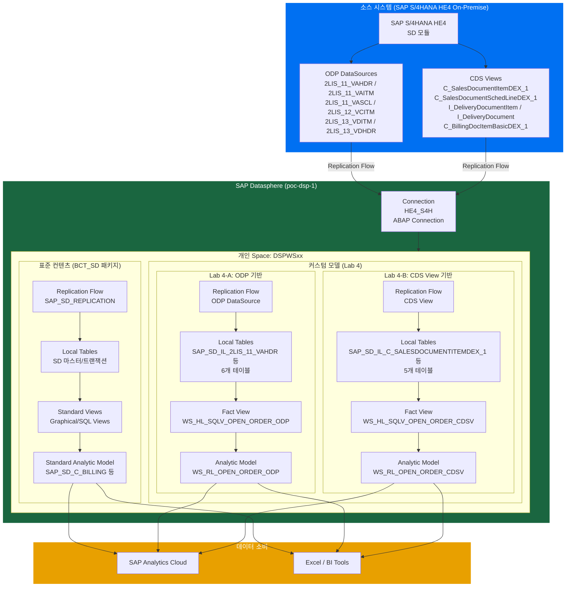
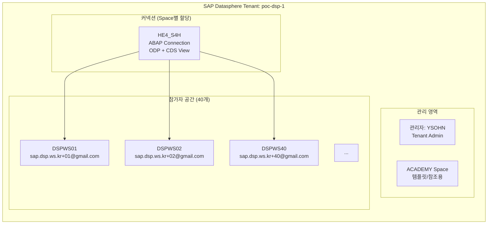
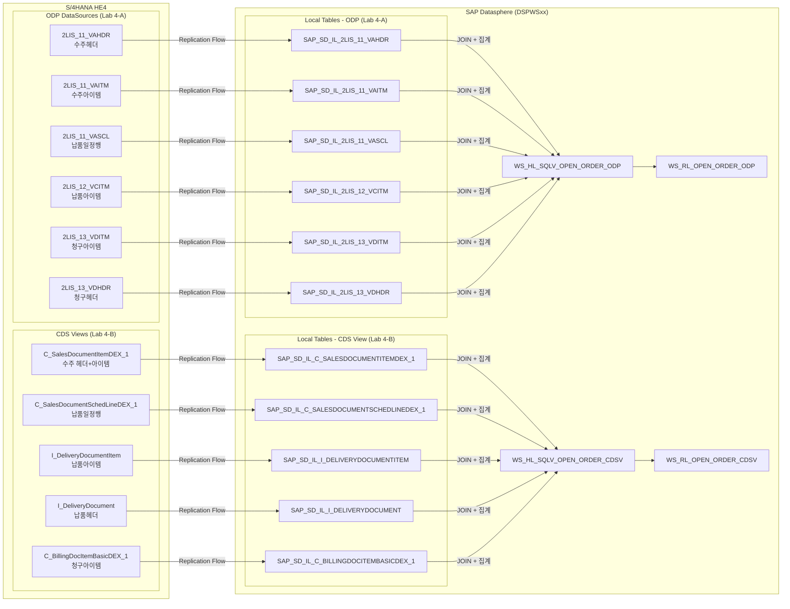
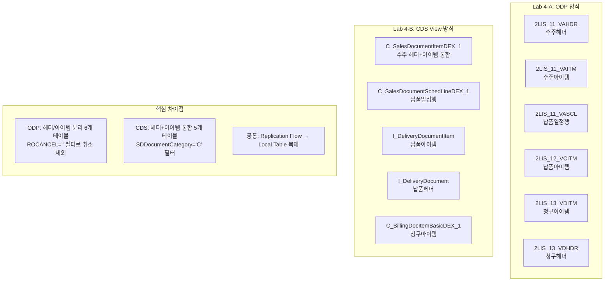
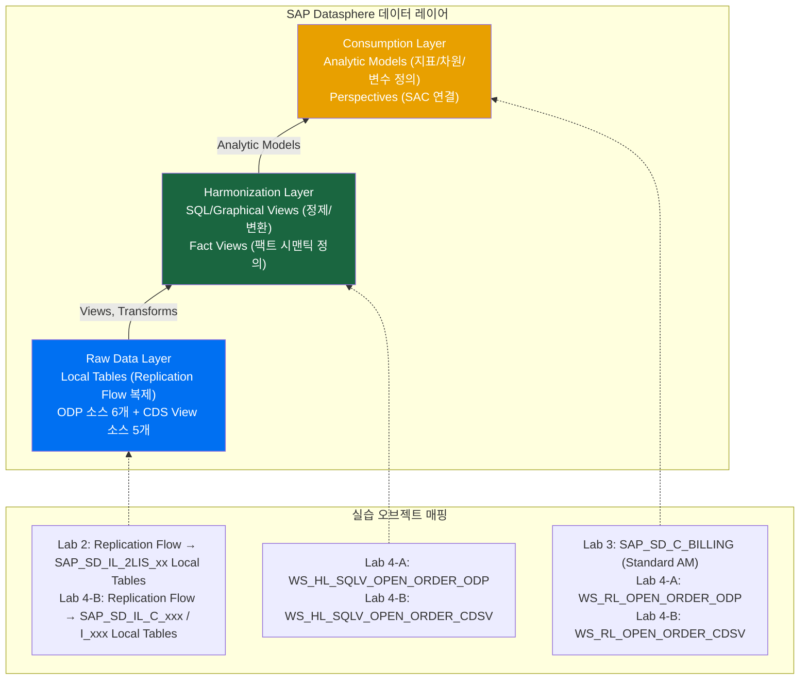

# 워크샵 전체 아키텍처

## 1. 전체 시스템 아키텍처

```mermaid
graph TB
    subgraph Source["소스 시스템 (SAP S/4HANA HE4 On-Premise)"]
        S4H[SAP S/4HANA HE4<br/>SD 모듈]
        ODP[ODP DataSources<br/>2LIS_11_VAHDR / 2LIS_11_VAITM<br/>2LIS_11_VASCL / 2LIS_12_VCITM<br/>2LIS_13_VDITM / 2LIS_13_VDHDR]
        CDS[CDS Views<br/>C_SalesDocumentItemDEX_1<br/>C_SalesDocumentSchedLineDEX_1<br/>I_DeliveryDocumentItem / I_DeliveryDocument<br/>C_BillingDocItemBasicDEX_1]
        S4H --> ODP
        S4H --> CDS
    end

    subgraph DSP["SAP Datasphere (poc-dsp-1)"]
        CONN[Connection<br/>HE4_S4H<br/>ABAP Connection]

        subgraph SPACE["개인 Space: DSPWSxx"]
            direction TB

            subgraph STD["표준 컨텐츠 (BCT_SD 패키지)"]
                RF[Replication Flow<br/>SAP_SD_REPLICATION]
                LT[Local Tables<br/>SD 마스터/트랜잭션]
                SV[Standard Views<br/>Graphical/SQL Views]
                AM_STD[Standard Analytic Model<br/>SAP_SD_C_BILLING 등]
                RF --> LT --> SV --> AM_STD
            end

            subgraph CUSTOM["커스텀 모델 (Lab 4)"]
                direction TB
                subgraph ODP_FLOW["Lab 4-A: ODP 기반"]
                    RF_ODP[Replication Flow<br/>ODP DataSource]
                    LT_ODP[Local Tables<br/>SAP_SD_IL_2LIS_11_VAHDR 등<br/>6개 테이블]
                    FV_ODP[Fact View<br/>WS_HL_SQLV_OPEN_ORDER_ODP]
                    AM_ODP[Analytic Model<br/>WS_RL_OPEN_ORDER_ODP]
                    RF_ODP --> LT_ODP --> FV_ODP --> AM_ODP
                end
                subgraph CDS_FLOW["Lab 4-B: CDS View 기반"]
                    RF_CDS[Replication Flow<br/>CDS View]
                    LT_CDS[Local Tables<br/>SAP_SD_IL_C_SALESDOCUMENTITEMDEX_1 등<br/>5개 테이블]
                    FV_CDS[Fact View<br/>WS_HL_SQLV_OPEN_ORDER_CDSV]
                    AM_CDS[Analytic Model<br/>WS_RL_OPEN_ORDER_CDSV]
                    RF_CDS --> LT_CDS --> FV_CDS --> AM_CDS
                end
            end
        end
    end

    subgraph CONSUME["데이터 소비"]
        SAC[SAP Analytics Cloud]
        EXCEL[Excel / BI Tools]
    end

    ODP --"Replication Flow"--> CONN
    CDS --"Replication Flow"--> CONN
    CONN --> SPACE
    AM_STD & AM_ODP & AM_CDS --> SAC
    AM_STD & AM_ODP & AM_CDS --> EXCEL

    style Source fill:#0070F2,color:#fff,stroke:#0070F2
    style DSP fill:#1A6640,color:#fff,stroke:#1A6640
    style CONSUME fill:#E8A000,color:#fff,stroke:#E8A000
```

---

## 2. 워크샵 Space 구성도

```mermaid
graph LR
    subgraph TENANT["SAP Datasphere Tenant: poc-dsp-1"]
        direction TB

        subgraph ADMIN["관리 영역"]
            YSOHN[관리자: YSOHN<br/>Tenant Admin]
            ACADEMY[ACADEMY Space<br/>템플릿/참조용]
        end

        subgraph USERS["참가자 공간 (40개)"]
            direction LR
            WS01["DSPWS01<br/>sap.dsp.ws.kr+01@gmail.com"]
            WS02["DSPWS02<br/>sap.dsp.ws.kr+02@gmail.com"]
            DOTS["..."]
            WS40["DSPWS40<br/>sap.dsp.ws.kr+40@gmail.com"]
        end

        subgraph CONN_POOL["커넥션 (Space별 할당)"]
            C1[HE4_S4H<br/>ABAP Connection<br/>ODP + CDS View]
        end
    end

    C1 --> WS01 & WS02 & WS40
```

---

## 3. 데이터 플로우 (Lab 2 & 4)

```mermaid
flowchart LR
    subgraph S4H["S/4HANA HE4"]
        subgraph ODP_SRC["ODP DataSources (Lab 4-A)"]
            O1[2LIS_11_VAHDR<br/>수주헤더]
            O2[2LIS_11_VAITM<br/>수주아이템]
            O3[2LIS_11_VASCL<br/>납품일정행]
            O4[2LIS_12_VCITM<br/>납품아이템]
            O5[2LIS_13_VDITM<br/>청구아이템]
            O6[2LIS_13_VDHDR<br/>청구헤더]
        end
        subgraph CDS_SRC["CDS Views (Lab 4-B)"]
            C1[C_SalesDocumentItemDEX_1<br/>수주 헤더+아이템]
            C2[C_SalesDocumentSchedLineDEX_1<br/>납품일정행]
            C3[I_DeliveryDocumentItem<br/>납품아이템]
            C4[I_DeliveryDocument<br/>납품헤더]
            C5[C_BillingDocItemBasicDEX_1<br/>청구아이템]
        end
    end

    subgraph DSP["SAP Datasphere (DSPWSxx)"]
        subgraph LOCAL_ODP["Local Tables - ODP (Lab 4-A)"]
            LT1[SAP_SD_IL_2LIS_11_VAHDR]
            LT2[SAP_SD_IL_2LIS_11_VAITM]
            LT3[SAP_SD_IL_2LIS_11_VASCL]
            LT4[SAP_SD_IL_2LIS_12_VCITM]
            LT5[SAP_SD_IL_2LIS_13_VDITM]
            LT6[SAP_SD_IL_2LIS_13_VDHDR]
        end
        subgraph LOCAL_CDS["Local Tables - CDS View (Lab 4-B)"]
            RT1[SAP_SD_IL_C_SALESDOCUMENTITEMDEX_1]
            RT2[SAP_SD_IL_C_SALESDOCUMENTSCHEDLINEDEX_1]
            RT3[SAP_SD_IL_I_DELIVERYDOCUMENTITEM]
            RT4[SAP_SD_IL_I_DELIVERYDOCUMENT]
            RT5[SAP_SD_IL_C_BILLINGDOCITEMBASICDEX_1]
        end
        FV_ODP[WS_HL_SQLV_OPEN_ORDER_ODP]
        AM_ODP[WS_RL_OPEN_ORDER_ODP]
        FV_CDS[WS_HL_SQLV_OPEN_ORDER_CDSV]
        AM_CDS[WS_RL_OPEN_ORDER_CDSV]
    end

    O1 -->|"Replication Flow"| LT1
    O2 -->|"Replication Flow"| LT2
    O3 -->|"Replication Flow"| LT3
    O4 -->|"Replication Flow"| LT4
    O5 -->|"Replication Flow"| LT5
    O6 -->|"Replication Flow"| LT6

    C1 -->|"Replication Flow"| RT1
    C2 -->|"Replication Flow"| RT2
    C3 -->|"Replication Flow"| RT3
    C4 -->|"Replication Flow"| RT4
    C5 -->|"Replication Flow"| RT5

    LT1 & LT2 & LT3 & LT4 & LT5 & LT6 -->|"JOIN + 집계"| FV_ODP --> AM_ODP
    RT1 & RT2 & RT3 & RT4 & RT5 -->|"JOIN + 집계"| FV_CDS --> AM_CDS
```

---

## 4. ODP vs CDS View 소스 비교

```mermaid
graph TB
    subgraph ODP["Lab 4-A: ODP 방식"]
        direction LR
        O_V[2LIS_11_VAHDR<br/>수주헤더]
        O_I[2LIS_11_VAITM<br/>수주아이템]
        O_SC[2LIS_11_VASCL<br/>납품일정행]
        O_DI[2LIS_12_VCITM<br/>납품아이템]
        O_BI[2LIS_13_VDITM<br/>청구아이템]
        O_BH[2LIS_13_VDHDR<br/>청구헤더]
    end

    subgraph CDS["Lab 4-B: CDS View 방식"]
        direction LR
        C_SD[C_SalesDocumentItemDEX_1<br/>수주 헤더+아이템 통합]
        C_SSL[C_SalesDocumentSchedLineDEX_1<br/>납품일정행]
        C_DDI[I_DeliveryDocumentItem<br/>납품아이템]
        C_DDH[I_DeliveryDocument<br/>납품헤더]
        C_BDI[C_BillingDocItemBasicDEX_1<br/>청구아이템]
    end

    subgraph DIFF["핵심 차이점"]
        direction TB
        D1["ODP: 헤더/아이템 분리 6개 테이블<br/>ROCANCEL='' 필터로 취소 제외"]
        D2["CDS: 헤더+아이템 통합 5개 테이블<br/>SDDocumentCategory='C' 필터"]
        D3["공통: Replication Flow → Local Table 복제"]
    end
```

---

## 5. SAP Datasphere 데이터 레이어 구조

```mermaid
graph BT
    subgraph DSP_LAYERS["SAP Datasphere 데이터 레이어"]
        direction BT

        L1["Raw Data Layer\nLocal Tables (Replication Flow 복제)\nODP 소스 6개 + CDS View 소스 5개"]
        L2["Harmonization Layer\nSQL/Graphical Views (정제/변환)\nFact Views (팩트 시맨틱 정의)"]
        L3["Consumption Layer\nAnalytic Models (지표/차원/변수 정의)\nPerspectives (SAC 연결)"]

        L1 -->|"Views, Transforms"| L2
        L2 -->|"Analytic Models"| L3
    end

    subgraph OBJECTS["실습 오브젝트 매핑"]
        OBJ1["Lab 2: Replication Flow → SAP_SD_IL_2LIS_xx Local Tables\nLab 4-B: Replication Flow → SAP_SD_IL_C_xxx / I_xxx Local Tables"]
        OBJ2["Lab 4-A: WS_HL_SQLV_OPEN_ORDER_ODP\nLab 4-B: WS_HL_SQLV_OPEN_ORDER_CDSV"]
        OBJ3["Lab 3: SAP_SD_C_BILLING (Standard AM)\nLab 4-A: WS_RL_OPEN_ORDER_ODP\nLab 4-B: WS_RL_OPEN_ORDER_CDSV"]
    end

    OBJ1 -.-> L1
    OBJ2 -.-> L2
    OBJ3 -.-> L3

    style L1 fill:#0070F2,color:#fff
    style L2 fill:#1A6640,color:#fff
    style L3 fill:#E8A000,color:#fff
```
