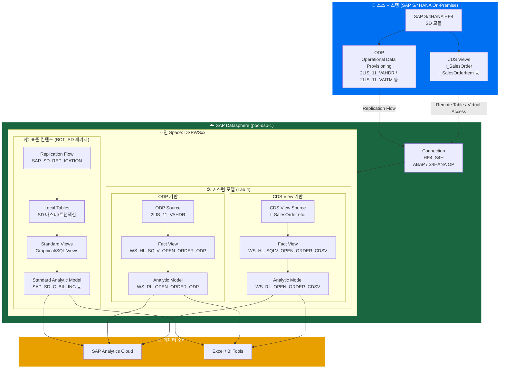
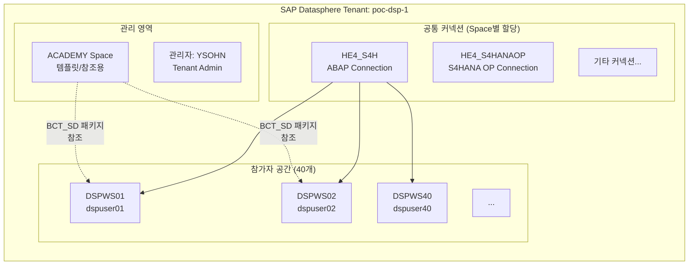
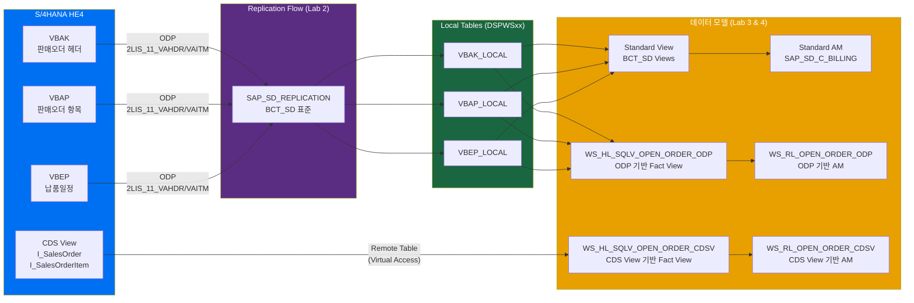
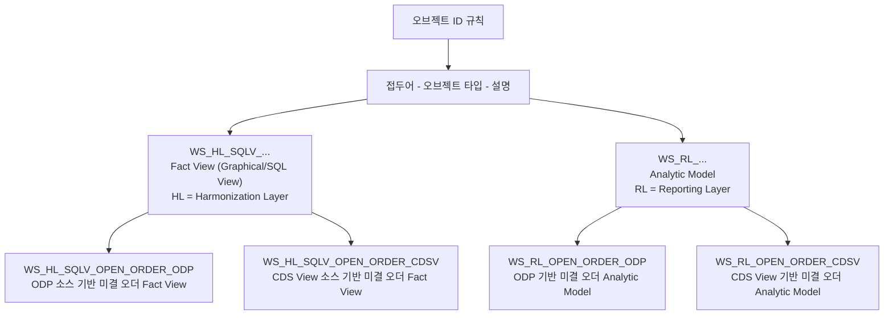
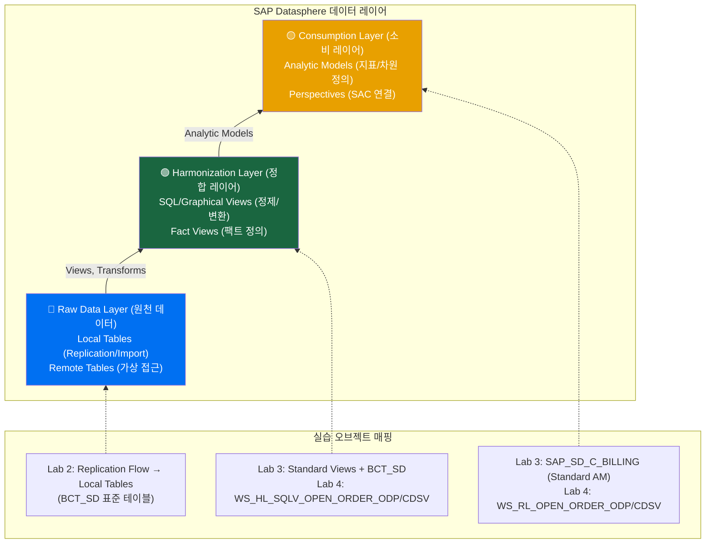

# 워크샵 전체 아키텍처

## 1. 전체 시스템 아키텍처

```mermaid
graph TB
    subgraph Source["🏢 소스 시스템 (SAP S/4HANA On-Premise)"]
        S4H[SAP S/4HANA HE4<br/>SD 모듈]
        ODP[ODP<br/>Operational Data Provisioning<br/>2LIS_11_VAHDR / 2LIS_11_VAITM 등]
        CDS[CDS Views<br/>I_SalesOrder<br/>I_SalesOrderItem 등]
        S4H --> ODP
        S4H --> CDS
    end

    subgraph DSP["☁️ SAP Datasphere (poc-dsp-1)"]
        CONN[Connection<br/>HE4_S4H<br/>ABAP / S4HANA OP]

        subgraph SPACE["개인 Space: DSPWSxx"]
            direction TB

            subgraph STD["📦 표준 컨텐츠 (BCT_SD 패키지)"]
                RF[Replication Flow<br/>SAP_SD_REPLICATION]
                LT[Local Tables<br/>SD 마스터/트랜잭션]
                SV[Standard Views<br/>Graphical/SQL Views]
                AM_STD[Standard Analytic Model<br/>SAP_SD_C_BILLING 등]
                RF --> LT --> SV --> AM_STD
            end

            subgraph CUSTOM["🛠️ 커스텀 모델 (Lab 4)"]
                direction TB
                subgraph ODP_FLOW["ODP 기반"]
                    ODP_SRC[ODP Source<br/>2LIS_11_VAHDR]
                    FV_ODP[Fact View<br/>WS_HL_SQLV_OPEN_ORDER_ODP]
                    AM_ODP[Analytic Model<br/>WS_RL_OPEN_ORDER_ODP]
                    ODP_SRC --> FV_ODP --> AM_ODP
                end
                subgraph CDS_FLOW["CDS View 기반"]
                    CDS_SRC[CDS View Source<br/>I_SalesOrder etc.]
                    FV_CDS[Fact View<br/>WS_HL_SQLV_OPEN_ORDER_CDSV]
                    AM_CDS[Analytic Model<br/>WS_RL_OPEN_ORDER_CDSV]
                    CDS_SRC --> FV_CDS --> AM_CDS
                end
            end
        end
    end

    subgraph CONSUME["📊 데이터 소비"]
        SAC[SAP Analytics Cloud]
        EXCEL[Excel / BI Tools]
    end

    ODP --"Replication Flow"--> CONN
    CDS --"Remote Table / Virtual Access"--> CONN
    CONN --> SPACE
    AM_STD --> SAC
    AM_ODP --> SAC
    AM_CDS --> SAC
    AM_STD --> EXCEL
    AM_ODP --> EXCEL
    AM_CDS --> EXCEL

    style Source fill:#0070F2,color:#fff,stroke:#0070F2
    style DSP fill:#1A6640,color:#fff,stroke:#1A6640
    style CONSUME fill:#E8A000,color:#fff,stroke:#E8A000
```

---

## 2. 워크샵 Space 구성도

```mermaid
graph LR
    subgraph TENANT["SAP Datasphere Tenant: poc-dsp-1"]
        direction TB

        subgraph ADMIN["관리 영역"]
            YSOHN[관리자: YSOHN<br/>Tenant Admin]
            ACADEMY[ACADEMY Space<br/>템플릿/참조용]
        end

        subgraph USERS["참가자 공간 (40개)"]
            direction LR
            WS01["DSPWS01<br/>dspuser01"]
            WS02["DSPWS02<br/>dspuser02"]
            DOTS["..."]
            WS40["DSPWS40<br/>dspuser40"]
        end

        subgraph CONN_POOL["공통 커넥션 (Space별 할당)"]
            C1[HE4_S4H<br/>ABAP Connection]
            C2[HE4_S4HANAOP<br/>S4HANA OP Connection]
            C3[기타 커넥션...]
        end
    end

    ACADEMY -.->|"BCT_SD 패키지<br/>참조"| WS01
    ACADEMY -.->|"BCT_SD 패키지<br/>참조"| WS02
    C1 --> WS01
    C1 --> WS02
    C1 --> WS40
```

---

## 3. 데이터 플로우 (Lab 2 & 4)

```mermaid
flowchart LR
    subgraph SRC["S/4HANA HE4"]
        T1[VBAK<br/>판매오더 헤더]
        T2[VBAP<br/>판매오더 항목]
        T3[VBEP<br/>납품일정]
        T4[CDS View<br/>I_SalesOrder<br/>I_SalesOrderItem]
    end

    subgraph REP["Replication Flow (Lab 2)"]
        RF_NODE[SAP_SD_REPLICATION<br/>BCT_SD 표준]
    end

    subgraph LOCAL["Local Tables (DSPWSxx)"]
        LT1[VBAK_LOCAL]
        LT2[VBAP_LOCAL]
        LT3[VBEP_LOCAL]
    end

    subgraph MODEL["데이터 모델 (Lab 3 & 4)"]
        SV1[Standard View<br/>BCT_SD Views]
        AM1[Standard AM<br/>SAP_SD_C_BILLING]
        FV_ODP2[WS_HL_SQLV_OPEN_ORDER_ODP<br/>ODP 기반 Fact View]
        AM_ODP2[WS_RL_OPEN_ORDER_ODP<br/>ODP 기반 AM]
        FV_CDS2[WS_HL_SQLV_OPEN_ORDER_CDSV<br/>CDS View 기반 Fact View]
        AM_CDS2[WS_RL_OPEN_ORDER_CDSV<br/>CDS View 기반 AM]
    end

    T1 & T2 & T3 -->|"ODP<br/>2LIS_11_VAHDR/VAITM"| RF_NODE
    RF_NODE --> LT1 & LT2 & LT3
    LT1 & LT2 & LT3 --> SV1 --> AM1
    LT1 & LT2 & LT3 --> FV_ODP2 --> AM_ODP2
    T4 -->|"Remote Table<br/>(Virtual Access)"| FV_CDS2 --> AM_CDS2

    style SRC fill:#0070F2,color:#fff
    style REP fill:#5A2D82,color:#fff
    style LOCAL fill:#1A6640,color:#fff
    style MODEL fill:#E8A000,color:#fff
```

---

## 4. 커스텀 모델 오브젝트 네이밍 규칙

```mermaid
graph TD
    A["오브젝트 ID 규칙"] --> B["접두어 - 오브젝트 타입 - 설명"]

    B --> C["WS_HL_SQLV_...<br/>Fact View (Graphical/SQL View)<br/>HL = Harmonization Layer"]
    B --> D["WS_RL_...<br/>Analytic Model<br/>RL = Reporting Layer"]

    C --> E["WS_HL_SQLV_OPEN_ORDER_ODP<br/>ODP 소스 기반 미결 오더 Fact View"]
    C --> F["WS_HL_SQLV_OPEN_ORDER_CDSV<br/>CDS View 소스 기반 미결 오더 Fact View"]
    D --> G["WS_RL_OPEN_ORDER_ODP<br/>ODP 기반 미결 오더 Analytic Model"]
    D --> H["WS_RL_OPEN_ORDER_CDSV<br/>CDS View 기반 미결 오더 Analytic Model"]
```

---

## 5. SAP Datasphere 레이어 구조

```mermaid
graph BT
    subgraph DSP_LAYERS["SAP Datasphere 데이터 레이어"]
        direction BT

        L1["🔵 Raw Data Layer (원천 데이터)\nLocal Tables (Replication/Import)\nRemote Tables (가상 접근)"]
        L2["🟢 Harmonization Layer (정합 레이어)\nSQL/Graphical Views (정제/변환)\nFact Views (팩트 정의)"]
        L3["🟡 Consumption Layer (소비 레이어)\nAnalytic Models (지표/차원 정의)\nPerspectives (SAC 연결)"]

        L1 -->|"Views, Transforms"| L2
        L2 -->|"Analytic Models"| L3
    end

    subgraph OBJECTS["실습 오브젝트 매핑"]
        OBJ1["Lab 2: Replication Flow → Local Tables<br/>(BCT_SD 표준 테이블)"]
        OBJ2["Lab 3: Standard Views + BCT_SD\nLab 4: WS_HL_SQLV_OPEN_ORDER_ODP/CDSV"]
        OBJ3["Lab 3: SAP_SD_C_BILLING (Standard AM)\nLab 4: WS_RL_OPEN_ORDER_ODP/CDSV"]
    end

    OBJ1 -.-> L1
    OBJ2 -.-> L2
    OBJ3 -.-> L3

    style L1 fill:#0070F2,color:#fff
    style L2 fill:#1A6640,color:#fff
    style L3 fill:#E8A000,color:#fff
```
