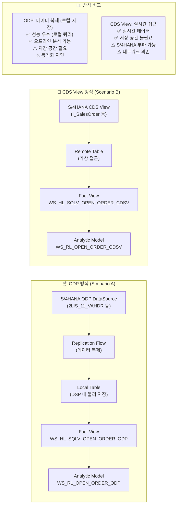
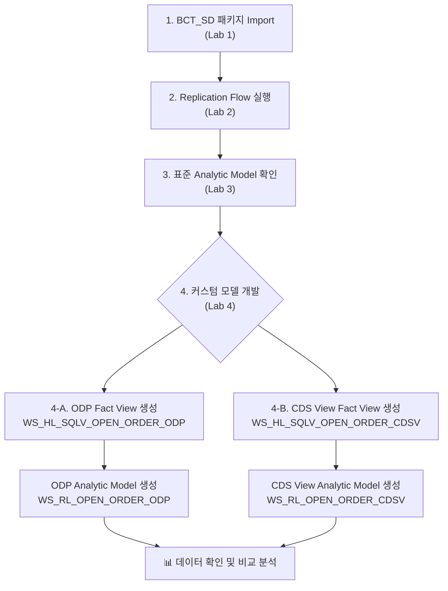

# 가상 고객 요건 (POC 시나리오)

## 배경

**고객사**: 가칭 "ABC Manufacturing Co."
**업종**: 제조업 (SAP S/4HANA 운영 중)
**현황**: SD 모듈 운영, 판매 오더 관리 및 납품 현황 분석 필요

---

## 고객 요건 요약

### 비즈니스 요건

> **"현재 SAP S/4HANA에서 SD 데이터를 기반으로 미결 판매 오더 현황을 분석하고자 합니다.
> SAP Datasphere를 통해 데이터를 통합하고, SAP Analytics Cloud에서 대시보드로 확인하고 싶습니다."**

### 핵심 분석 요건

| # | 분석 항목 | 주요 측정값 | 주요 차원 |
|---|-----------|------------|----------|
| 1 | 미결 판매 오더 현황 | 오더 수량, 오더 금액 | 판매 조직, 고객, 자재, 기간 |
| 2 | 납품 일정 준수율 | 약속 납기 vs 실제 납기 | 고객, 자재, 기간 |
| 3 | 채널별 매출 분석 | 매출 금액, 할인 금액 | 유통 채널, 판매 조직, 기간 |
| 4 | 자재별 판매 트렌드 | 판매 수량, 금액 추이 | 자재 그룹, 기간 |

---

## 소스 데이터 요건

### 시나리오 A: ODP 기반 (Lab 4-A)

S/4HANA ODP(Operational Data Provisioning)를 소스로 활용

```
소스: S/4HANA ODP DataSource
  ├── 2LIS_11_VAHDR (판매 오더 헤더)
  ├── 2LIS_11_VAITM (판매 오더 항목)
  └── 2LIS_11_VASTH (판매 오더 상태)

적재 방식: Replication Flow → Local Tables
접근 방식: 로컬 테이블 기반 Fact View 생성
```

**결과 오브젝트:**
- Fact View: `WS_HL_SQLV_OPEN_ORDER_ODP`
- Analytic Model: `WS_RL_OPEN_ORDER_ODP`

---

### 시나리오 B: CDS View 기반 (Lab 4-B)

S/4HANA CDS(Core Data Services) View를 소스로 직접 활용

```
소스: S/4HANA CDS Views (가상 접근 / Remote Table)
  ├── I_SalesOrder (판매 오더 헤더 CDS)
  ├── I_SalesOrderItem (판매 오더 항목 CDS)
  └── I_SalesOrderScheduleLine (납품 일정 CDS)

접근 방식: Remote Table (가상 테이블) → Fact View 생성
```

**결과 오브젝트:**
- Fact View: `WS_HL_SQLV_OPEN_ORDER_CDSV`
- Analytic Model: `WS_RL_OPEN_ORDER_CDSV`

---

## 개발 요건 상세

### Fact View 공통 요건

| 필드명 | 설명 | 소스 필드 | 비고 |
|--------|------|----------|------|
| `VBELN` | 판매 오더 번호 | VBAK.VBELN / I_SalesOrder.SalesOrder | Key |
| `POSNR` | 판매 오더 항목 번호 | VBAP.POSNR / I_SalesOrderItem.SalesOrderItem | Key |
| `KUNNR` | 고객 코드 | VBAK.KUNNR | 차원 |
| `MATNR` | 자재 코드 | VBAP.MATNR | 차원 |
| `VKORG` | 판매 조직 | VBAK.VKORG | 차원 |
| `VTWEG` | 유통 채널 | VBAK.VTWEG | 차원 |
| `SPART` | 제품군 | VBAK.SPART | 차원 |
| `AUDAT` | 오더 생성일 | VBAK.AUDAT | 차원(날짜) |
| `NETWR` | 순 금액 (오더 헤더) | VBAK.NETWR | 측정값 |
| `KWMENG` | 오더 수량 | VBAP.KWMENG | 측정값 |
| `NETPR` | 순 단가 | VBAP.NETPR | 측정값 |
| `GBSTA` | 전체 처리 상태 | VBUK.GBSTA | 필터용 |

### 미결 오더 필터 조건

```sql
-- 미결 오더 = 전체 처리 상태가 완료되지 않은 오더
WHERE GBSTA NOT IN ('C')  -- C = 완전히 처리됨
  AND ABGRU IS NULL       -- 거절 사유 없음
```

---

### Analytic Model 요건

#### 측정값 (Measures)

| 측정값 ID | 설명 | 계산식 | 집계 |
|----------|------|--------|------|
| `NET_AMOUNT` | 미결 오더 순금액 | `SUM(NETWR)` | SUM |
| `ORDER_QTY` | 미결 오더 수량 | `SUM(KWMENG)` | SUM |
| `ORDER_COUNT` | 오더 건수 | `COUNT(DISTINCT VBELN)` | COUNT |
| `AVG_ORDER_AMT` | 평균 오더 금액 | `NET_AMOUNT / ORDER_COUNT` | 계산 |

#### 차원 (Dimensions)

| 차원 ID | 설명 | 계층 | 연결 마스터 |
|---------|------|------|------------|
| `KUNNR` | 고객 | 판매 조직 > 고객 | KNA1 (고객 마스터) |
| `MATNR` | 자재 | 자재 그룹 > 자재 | MARA (자재 마스터) |
| `VKORG` | 판매 조직 | - | T001W |
| `VTWEG` | 유통 채널 | - | - |
| `AUDAT` | 오더 생성일 | 연 > 분기 > 월 > 일 | 날짜 차원 |

---

## 비교 분석: ODP vs CDS View



| 비교 항목 | ODP 방식 | CDS View 방식 |
|----------|---------|--------------|
| **데이터 최신성** | 복제 주기에 따라 | 실시간 |
| **쿼리 성능** | 높음 (로컬) | S/4HANA 성능 의존 |
| **저장 공간** | 필요 | 불필요 |
| **S/4HANA 부하** | 복제 시만 | 매 쿼리마다 |
| **적합한 용도** | 대용량, 히스토리 분석 | 실시간 모니터링 |
| **DSP 오브젝트** | Local Table → View | Remote Table → View |

---

## 개발 순서 권장


