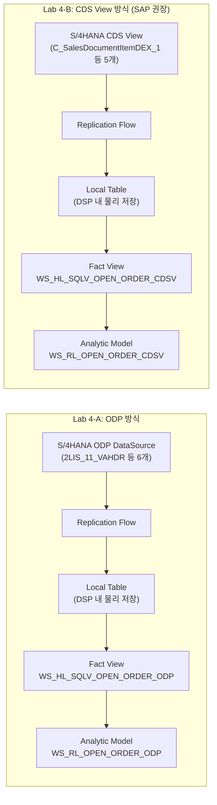
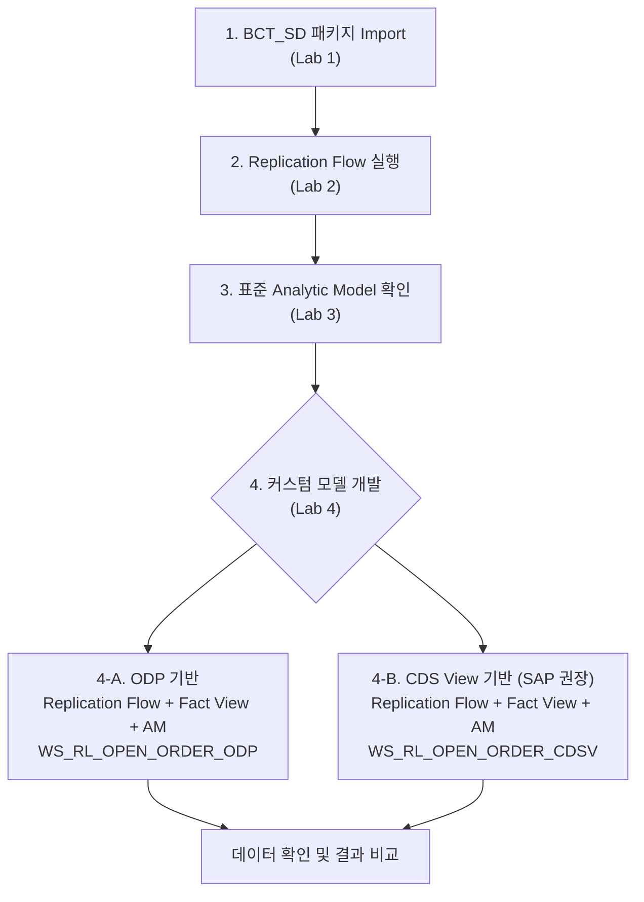

# 가상 고객 요건 (POC 시나리오)

## 배경

**고객사**: 가칭 "ABC Manufacturing Co."
**업종**: 제조업 (SAP S/4HANA 운영 중, 시스템 코드: HE4)
**현황**: SD 모듈 운영 중. 판매 오더 접수부터 출하·청구까지의 진행 현황을 실시간으로 분석하고자 하나, 현행 SAP ERP 보고서로는 기간 비교 분석과 납기 준수율 모니터링에 한계가 있음.

---

## 공통 필터 조건

모든 분석 요건에 공통으로 적용되는 필터:

```
VKORG NOT IN ('7600', '7700')   -- 특정 판매조직 제외 (국내 제조·직판)
```

---

## 분석 요건 1: Open Order 진행현황

### 비즈니스 목적

> **"주문 접수 대비 재고 Confirmed 수량 및 출하 진행량을 실시간으로 파악하고, 권역별 재고를 선제적으로 조달하여 납기 준수 및 빠른 매출로 이어지도록 한다."**

### 대상 범위

- 판매전표 유형: `VBAK-VBTYP = 'C'` (Sales Order만)
- 생성일 범위: `ERDAT` 기준 최근 6개월

### AS-IS 소스 테이블 (S/4HANA ERP 직접 조회)

| 시스템 | 테이블 | 설명 | 비고 |
|--------|--------|------|------|
| HE4 | `VBAK` | Sales Document Header | 기준 헤더 |
| HE4 | `VBAP` | Sales Document Item | JOIN: VBELN |
| HE4 | `VBEP` | Sales Document Schedule Line | JOIN: VBELN+POSNR, VBAP 레벨 집계 후 매칭 |
| HE4 | `VBUK` | Sales Document: Header Status | 상태 정보 |
| HE4 | `VBUP` | Sales Document: Item Status | 상태 정보 |
| HE4 | `LIKP` | Delivery Header Data | JOIN: VBELN(LIPS-VBELN) |
| HE4 | `LIPS` | Delivery Item Data | JOIN: VGBEL=VBAP-VBELN, VGPOS=VBAP-POSNR |
| HE4 | `VBRK` | Billing Document Header | JOIN: VBELN(VBRP) |
| HE4 | `VBRP` | Billing Document Item | JOIN: AUBEL=VBAP-VBELN, AUPOS=VBAP-POSNR |
| HE4 | `KNA1` | Customer Master | JOIN: KUNNR=VBAK-KUNNR |
| HE4 | `ZCBO_MAT_CLASS` | 자재 분류정보 | JOIN: MATNR=VBAP-MATNR |

### 주요 계산 필드

| 필드명 | 계산 방식 | 설명 |
|--------|----------|------|
| `Order QTY` | `VBAP-KWMENG` | 판매문서 주문수량 |
| `Confirmed QTY` | `SUM(VBEP-BMENG)` (VBAP 레벨 집계) | 자재가용성 확정수량 |
| `GI QTY` | `SUM(LIPS-LFIMG)` (VBAP 레벨 집계) | 출고수량 |
| `GI Date` | `MAX(LIKP-WADAT_IST)` (동일 판매문서 중 최대) | 실제 출고일자 |
| `Bill QTY` | `SUM(VBRP-FKIMG)` (VBAP 레벨 집계) | 청구수량 |
| `Billing Date` | `MAX(VBRK-FKDAT)` (동일 판매문서 중 최대) | 청구일자 |

### TO-BE 소스 (SAP Datasphere — 이번 워크샵 대상)

두 가지 방식으로 Datasphere에 데이터를 적재하여 분석 모델을 개발합니다.

**방식 A: ODP DataSource 기반 (Lab 4-A)**

```
S/4HANA ODP DataSource → Replication Flow → Local Table
  ├── 2LIS_11_VAHDR  → SAP_SD_IL_2LIS_11_VAHDR   (수주 헤더)
  ├── 2LIS_11_VAITM  → SAP_SD_IL_2LIS_11_VAITM   (수주 아이템)
  ├── 2LIS_11_VASCL  → SAP_SD_IL_2LIS_11_VASCL   (납품일정행 - 확정수량)
  ├── 2LIS_12_VCITM  → SAP_SD_IL_2LIS_12_VCITM   (납품 아이템 - 출고수량/일자)
  ├── 2LIS_13_VDITM  → SAP_SD_IL_2LIS_13_VDITM   (청구 아이템 - 청구수량/금액)
  └── 2LIS_13_VDHDR  → SAP_SD_IL_2LIS_13_VDHDR   (청구 헤더)
```

취소 레코드 필터 방식: `ROCANCEL = ''`

결과 오브젝트:
- Fact View: `WS_HL_SQLV_OPEN_ORDER_ODP`
- Analytic Model: `WS_RL_OPEN_ORDER_ODP`

**방식 B: CDS View 기반 — SAP 향후 권장 방식 (Lab 4-B)**

```
S/4HANA CDS View → Replication Flow → Local Table
  ├── C_SalesDocumentItemDEX_1       → SAP_SD_IL_C_SALESDOCUMENTITEMDEX_1          (수주 헤더+아이템 통합)
  ├── C_SalesDocumentSchedLineDEX_1  → SAP_SD_IL_C_SALESDOCUMENTSCHEDLINEDEX_1     (납품일정행 - 확정수량)
  ├── I_DeliveryDocumentItem         → SAP_SD_IL_I_DELIVERYDOCUMENTITEM             (납품 아이템 - 출고수량)
  ├── I_DeliveryDocument             → SAP_SD_IL_I_DELIVERYDOCUMENT                 (납품 헤더 - 출고일자)
  └── C_BillingDocItemBasicDEX_1     → SAP_SD_IL_C_BILLINGDOCITEMBASICDEX_1        (청구 아이템 - 청구수량/금액)
```

취소 레코드 필터 방식: `SDDocumentCategory = 'C'`, `BillingDocumentIsCancelled = ''`

결과 오브젝트:
- Fact View: `WS_HL_SQLV_OPEN_ORDER_CDSV`
- Analytic Model: `WS_RL_OPEN_ORDER_CDSV`

---

## 분석 요건 2: RDD 납기 준수여부 (Open Order 모델 확장)

### 비즈니스 목적

> **"판매문서의 납품요청일(RDD) 대비 실제 출하일 기준으로 납기 준수 여부를 판단하여, 지연 오더를 조기에 식별하고 개선 액션을 취할 수 있도록 한다."**

### 비교 기준

| 항목 | 기준 |
|------|------|
| 납품요청일 (RDD) | `VBAK-VDATU` (ODP) / `RequestedDeliveryDate` (CDS) |
| 실제 납품일 | 판매문서 후속 납품문서의 **최대 실제출하전기일**: `MAX(LIKP-WADAT_IST)` |

> 예시: 판매문서(RDD: 2026.05.30)의 후속 납품문서 실제납품일이 2건(2026.05.10, 2026.05.28)인 경우, **최대값 2026.05.28**을 기준으로 비교

### 납품 진행 상태 정의

| 상태 | 조건 |
|------|------|
| `Not Started` (미진행) | 후속 납품문서가 없거나 최대 실제납품일자가 없는 경우 |
| `In Progress` (진행 중) | 주문수량 대비 미납수량이 존재하면서 최대 실제납품일자가 있는 경우 |
| `Completed` (납품완료) | 주문수량 대비 미납수량이 0 이하인 경우 |

### Lead-time 계산 방식

```
DATEDIFF('day', 납품요청일, 비교기준일)
  - 납품완료 상태:  비교기준일 = MAX(실제납품일자)
  - 미진행/진행 상태: 비교기준일 = CURRENT_DATE
```

### 준수여부 판단 기준

| 결과 | 조건 |
|------|------|
| `On-Time` | 납품요청일 >= 실제납품일 (차이값 0 이하) |
| `Delay` | 납품요청일 < 실제납품일 (차이값 양수) |

---

## 분석 요건 3: Sell-in 실적현황 (참고 — 본 워크샵 범위 외)

> **이 요건은 이번 워크샵 실습 범위에는 포함되지 않지만, 고객의 전체 요건 배경으로 참고합니다.**

### 비즈니스 목적

청구 기준의 SD Sell-in 실적 현황을 분석. ZCBO 프로그램 로직 기반.

### AS-IS 소스 테이블

| 시스템 | 테이블 | 설명 |
|--------|--------|------|
| HE4 | `VBRK` | Billing Document Header |
| HE4 | `VBRP` | Billing Document Item |
| HE4 | `VBAK` | Sales Document Header (참조) |
| HE4 | `KNA1` | Customer Master |
| HE4 | `ZCBO_MAT_CLASS` | 자재 분류정보 |
| HE4 | `ZCBO_BIZ_TYPE` | 비즈니스 유형 판정 테이블 |

### 주요 제외 조건

| 구분 | 조건 | 설명 |
|------|------|------|
| Intercompany Billing 제외 | `VBRK-FKART IN ('ZINB', 'ZVSB')` | 법인간 거래 청구 제외 |
| FI 전기 미처리 제외 | `VBRK-RFBSK = ' '` | FI Posting 미완료 건 제외 |
| 취소 청구 제외 | `VBRK-SFAKN <> ''` 또는 `VBRK-FKSTO <> ''` | 취소된 청구전표 제외 |
| 관계사 거래 제외 | `VBRK-KTGRD = '03'` | 관계사간 거래 제외 |

### 반품 및 Credit 처리 (마이너스 부호)

조건: `VBRP-AUTYP = 'H'` or `VBRP-AUTYP = 'K'` or `VBRP-VGTYP = 'T'`

대상 필드에 `-1` 적용:
- `VBRP-FKIMG` (청구수량)
- `VBRP-BRGEW` (중량)
- `VBRP-NETWR` (청구금액)
- `VBRP-KZWI1`, `VBRP-WAVWR` (조건금액)

### Credit/Debit Memo 수량 0 처리

조건: `VBRP-PSTYV IN ('ZCR1', 'ZDR1')` → FKIMG, BRGEW = 0

---

## Fact View 핵심 필드 (Open Order)

### 두 방식 공통 출력 필드

| 필드명 | 설명 | ODP 소스 | CDS View 소스 |
|--------|------|----------|--------------|
| `VBELN` / `SalesDocument` | 수주번호 (Key) | `2LIS_11_VAHDR.VBELN` | `C_SalesDocumentItemDEX_1.SalesDocument` |
| `POSNR` / `SalesDocumentItem` | 수주항목번호 (Key) | `2LIS_11_VAITM.POSNR` | `C_SalesDocumentItemDEX_1.SalesDocumentItem` |
| `ERDAT` | 생성일 | `2LIS_11_VAHDR.ERDAT` | `SalesDocumentDate` (변환) |
| `CalendarYearMonth` | 생성년월 | `TO_VARCHAR(ERDAT,'YYYYMM')` | `TO_VARCHAR(SalesDocumentDate,'YYYYMM')` |
| `VDATU` | 납품요청일 (RDD) | `2LIS_11_VAHDR.VDATU` | `RequestedDeliveryDate` (변환) |
| `VKORG` / `SalesOrganization` | 판매조직 | `2LIS_11_VAHDR.VKORG` | `C_SalesDocumentItemDEX_1.SalesOrganization` |
| `KUNNR` / `SoldToParty` | 주문자 | `2LIS_11_VAHDR.KUNNR` | `C_SalesDocumentItemDEX_1.SoldToParty` |
| `MATNR` / `Material` | 자재번호 | `2LIS_11_VAITM.MATNR` | `C_SalesDocumentItemDEX_1.Material` |
| `KWMENG` | 주문수량 | `2LIS_11_VAITM.KWMENG` | `OrderQuantity` (변환) |
| `CONFIRMED_QTY` | 확정수량 | `SUM(2LIS_11_VASCL.BMENG)` | `SUM(ConfdOrderQtyByMatlAvailCheck)` |
| `GI_QTY` | 출고수량 | `SUM(2LIS_12_VCITM.LFIMG)` | `SUM(ActualDeliveredQtyInBaseUnit)` |
| `GI_DATE` | 출고일자 | `MAX(2LIS_12_VCITM.WADAT_IST)` | `MAX(ActualGoodsMovementDate)` |
| `BILL_QTY` | 청구수량 | `SUM(2LIS_13_VDITM.FKIMG)` | `SUM(BillingQuantityInBaseUnit)` |
| `BILL_AMT` | 청구금액 | `SUM(2LIS_13_VDITM.NETWR)` | `SUM(NetAmount)` |
| `OPEN_DLV_QTY` | 미납품수량 | `KWMENG - GI_QTY` | `OrderQuantity - GI_QTY` |
| `UNBILLED_QTY` | 미청구수량 | `GI_QTY - BILL_QTY` | `GI_QTY - BILL_QTY` |
| `DELIVERY_STATUS` | 납품진행상태 | CASE WHEN (Not Started / In Progress / Completed) | 동일 |
| `COMPARISON_DATE` | 비교기준일 | GI_DATE (완료) or CURRENT_DATE | 동일 |
| `RDD_LEADTIME_DAYS` | 납품요청일 리드타임(일) | `DAYS_BETWEEN(VDATU, 비교기준일)` | 동일 |
| `RDD_COMPLIANCE` | RDD 준수여부 | On-Time / Delay | 동일 |

### 미결 오더 핵심 필터 조건 비교

```sql
-- ODP 방식
WHERE H.VBTYP = 'C'                       -- 수주 전표만
  AND H.ROCANCEL = ''                      -- 헤더 취소 제외
  AND I.ROCANCEL = ''                      -- 아이템 취소 제외
  AND (I.ABGRU = '' OR I.ABGRU IS NULL)   -- 거부 제외
  AND H.VKORG NOT IN ('7600', '7700')

-- CDS View 방식
WHERE I.SDDocumentCategory = 'C'          -- 수주 전표만
  AND (I.SalesDocumentRjcnReason = '' OR I.SalesDocumentRjcnReason IS NULL)
  AND I.SalesOrganization NOT IN ('7600', '7700')
```

---

## Analytic Model 요건

### BASE Measures

| Measure | 설명 | 집계 |
|---------|------|------|
| `KWMENG` | 주문수량 | SUM |
| `CONFIRMED_QTY` | 확정수량 | SUM |
| `GI_QTY` | 출고수량 | SUM |
| `BILL_QTY` | 청구수량 | SUM |
| `BILL_AMT` | 청구금액 | SUM |
| `OPEN_DLV_QTY` | 미납품수량 | SUM |
| `UNBILLED_QTY` | 미청구수량 | SUM |
| `RDD_LEADTIME_DAYS` | 납기 리드타임(일) | SUM / AVG |

### RESTRICTION Measures (기간 비교 분석)

| Measure | 설명 | 필터 조건 |
|---------|------|---------|
| `Measure_Value` | 전체 (필터 없음) | - |
| `01_CURR_MONTH` | 당월 | `CalendarYearMonth = RV_CURR_MONTH` |
| `02_PRE_MONTH` | 전월 | `CalendarYearMonth = RV_PREVIOUS_MONTH` |
| `03_CURRENT_YEAR_CUMUL` | 당년 누계 | `CalendarYearMonth BETWEEN RV_CURR_YEAR_JAN AND RV_CURR_MONTH` |
| `04_PRE_YEAR_CUM` | 전년 누계 | `CalendarYearMonth BETWEEN RV_PREVIOUS_YEAR_JAN AND RV_PREVIOUS_YEAR_SAME_MONTH` |
| `05_PRE_SAME_MONTH` | 전년동기 | `CalendarYearMonth = RV_PREVIOUS_YEAR_SAME_MONTH` |

### Variables (기준월 자동 계산)

| Variable | 설명 | 비고 |
|----------|------|------|
| `P_MONTH` | 기준월 (사용자 입력, YYYYMM 형식) | 기본값: `202501` |
| `RV_CURR_MONTH` | 당월 | `P_MONTH` 기준 자동 계산 |
| `RV_PREVIOUS_MONTH` | 전월 | `V_MONTH_COMPARISON` View 참조 |
| `RV_CURR_YEAR_JAN` | 당년 1월 | `V_MONTH_COMPARISON` View 참조 |
| `RV_PREVIOUS_YEAR_SAME_MONTH` | 전년동기월 | `V_MONTH_COMPARISON` View 참조 |
| `RV_PREVIOUS_YEAR_JAN` | 전년 1월 | `V_MONTH_COMPARISON` View 참조 |

> `P_MONTH` 하나만 입력하면 나머지 5개 변수가 자동으로 계산됩니다.

---

## 방식 비교: ODP vs CDS View

두 방식 모두 **Replication Flow → Local Table** 구조이며, 소스 DataSource 종류만 다릅니다.



| 비교 항목 | ODP 방식 (Lab 4-A) | CDS View 방식 (Lab 4-B) |
|----------|--------------------|------------------------|
| 데이터 적재 | Replication Flow → Local Table | Replication Flow → Local Table |
| 소스 종류 | ODP DataSource (2LIS_xx_xxx) | S/4HANA CDS View |
| 소스 수 | 6개 (헤더/아이템 분리) | 5개 (헤더+아이템 일부 통합) |
| 취소 레코드 필터 | `ROCANCEL = ''` | `BillingDocumentIsCancelled = ''` 등 |
| 수주 전표 필터 | `VBTYP = 'C'` | `SDDocumentCategory = 'C'` |
| SAP 방향성 | 기존 방식 (Deprecated 예정) | SAP 향후 권장 방식 |

> ODP DataSource는 SAP의 구형 추출 방식으로, SAP은 CDS View 기반 추출을 향후 표준으로 권장하고 있습니다.

---

## 개발 순서


