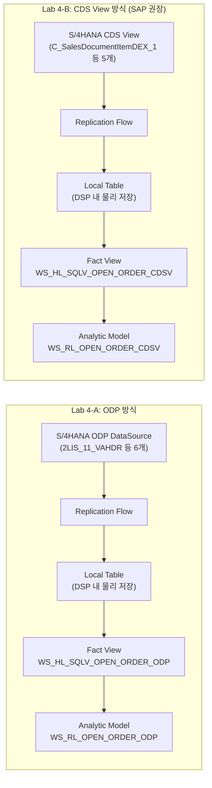
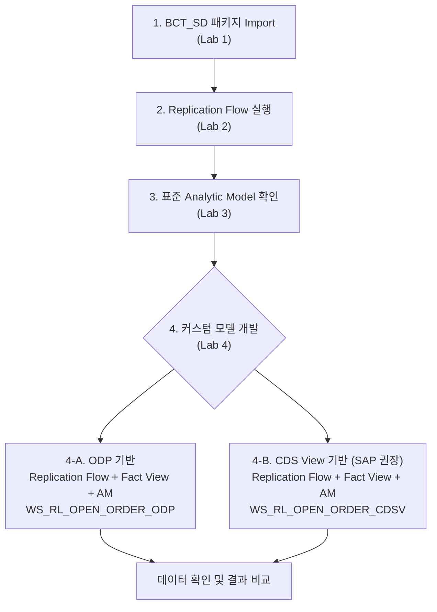

# 가상 고객 요건 (POC 시나리오)

## 배경

**고객사**: 가칭 "ABC Manufacturing Co."
**업종**: 제조업 (SAP S/4HANA 운영 중)
**현황**: SD 모듈 운영, 판매 오더 관리 및 납품 현황 분석 필요

---

## 고객 요건 요약

### 비즈니스 요건

> **"현재 SAP S/4HANA에서 SD 데이터를 기반으로 미결 판매 오더 현황을 분석하고자 합니다.
> SAP Datasphere를 통해 데이터를 통합하고, SAP Analytics Cloud에서 대시보드로 확인하고 싶습니다."**

### 핵심 분석 요건

| # | 분석 항목 | 주요 측정값 | 주요 차원 |
|---|-----------|------------|----------|
| 1 | 미결 판매 오더 현황 | 주문수량, 확정수량, 미납품수량 | 판매 조직, 고객, 자재, 기간 |
| 2 | 납품 일정 준수율 (RDD Compliance) | 리드타임(일), On-Time/Delay 비율 | 고객, 자재, 기간 |
| 3 | 출하/청구 진행 현황 | 출고수량, 청구수량, 미청구수량 | 판매 조직, 유통 채널 |
| 4 | 기간별 비교 분석 | 당월/전월/당년누계/전년동기 | 기간 (CalendarYearMonth) |

---

## 소스 데이터 요건

### 시나리오 A: ODP 기반 (Lab 4-A)

S/4HANA ODP(Operational Data Provisioning)를 소스로 활용

```
소스: S/4HANA ODP DataSource
  ├── 2LIS_11_VAHDR  (수주 헤더)
  ├── 2LIS_11_VAITM  (수주 아이템)
  ├── 2LIS_11_VASCL  (납품일정행 - 확정수량)
  ├── 2LIS_12_VCITM  (납품 아이템 - 출고수량/일자)
  ├── 2LIS_13_VDITM  (청구 아이템 - 청구수량/금액)
  └── 2LIS_13_VDHDR  (청구 헤더)

적재 방식: Replication Flow → Local Tables
```

**결과 오브젝트:**
- Fact View: `WS_HL_SQLV_OPEN_ORDER_ODP`
- Analytic Model: `WS_RL_OPEN_ORDER_ODP`

---

### 시나리오 B: CDS View 기반 (Lab 4-B)

S/4HANA CDS(Core Data Services) View를 소스로 활용. SAP이 ODP를 대체하는 향후 권장 방식.

```
소스: S/4HANA CDS Views
  ├── C_SalesDocumentItemDEX_1          (수주 헤더+아이템 통합)
  ├── C_SalesDocumentSchedLineDEX_1     (납품일정행 - 확정수량)
  ├── I_DeliveryDocumentItem             (납품 아이템 - 출고수량)
  ├── I_DeliveryDocument                 (납품 헤더 - 출고일자)
  └── C_BillingDocItemBasicDEX_1        (청구 아이템 - 청구수량/금액)

적재 방식: Replication Flow → Local Tables
```

**결과 오브젝트:**
- Fact View: `WS_HL_SQLV_OPEN_ORDER_CDSV`
- Analytic Model: `WS_RL_OPEN_ORDER_CDSV`

---

## 개발 요건 상세

### Fact View 주요 필드

| 필드명 | 설명 | ODP 소스 | CDS View 소스 |
|--------|------|----------|--------------|
| `VBELN` / `SalesDocument` | 수주번호 (Key) | `2LIS_11_VAHDR.VBELN` | `C_SalesDocumentItemDEX_1.SalesDocument` |
| `POSNR` / `SalesDocumentItem` | 수주항목번호 (Key) | `2LIS_11_VAITM.POSNR` | `C_SalesDocumentItemDEX_1.SalesDocumentItem` |
| `ERDAT` | 생성일 | `2LIS_11_VAHDR.ERDAT` | `SalesDocumentDate` (변환) |
| `CalendarYearMonth` | 생성년월 | `TO_VARCHAR(ERDAT,'YYYYMM')` | `TO_VARCHAR(SalesDocumentDate,'YYYYMM')` |
| `VDATU` | 납품요청일 (RDD) | `2LIS_11_VAHDR.VDATU` | `RequestedDeliveryDate` (변환) |
| `VKORG` / `SalesOrganization` | 판매조직 | `2LIS_11_VAHDR.VKORG` | `C_SalesDocumentItemDEX_1.SalesOrganization` |
| `KUNNR` / `SoldToParty` | 주문자 | `2LIS_11_VAHDR.KUNNR` | `C_SalesDocumentItemDEX_1.SoldToParty` |
| `MATNR` / `Material` | 자재번호 | `2LIS_11_VAITM.MATNR` | `C_SalesDocumentItemDEX_1.Material` |
| `KWMENG` | 주문수량 | `2LIS_11_VAITM.KWMENG` | `OrderQuantity` (변환) |
| `CONFIRMED_QTY` | 확정수량 | `SUM(2LIS_11_VASCL.BMENG)` | `SUM(ConfdOrderQtyByMatlAvailCheck)` |
| `GI_QTY` | 출고수량 | `SUM(2LIS_12_VCITM.LFIMG)` | `SUM(ActualDeliveredQtyInBaseUnit)` |
| `GI_DATE` | 출고일자 | `MAX(2LIS_12_VCITM.WADAT_IST)` | `MAX(ActualGoodsMovementDate)` |
| `BILL_QTY` | 청구수량 | `SUM(2LIS_13_VDITM.FKIMG)` | `SUM(BillingQuantityInBaseUnit)` |
| `BILL_AMT` | 청구금액 | `SUM(2LIS_13_VDITM.NETWR)` | `SUM(NetAmount)` |
| `OPEN_DLV_QTY` | 미납품수량 | `KWMENG - GI_QTY` | `OrderQuantity - GI_QTY` |
| `UNBILLED_QTY` | 미청구수량 | `GI_QTY - BILL_QTY` | `GI_QTY - BILL_QTY` |
| `DELIVERY_STATUS` | 납품진행상태 | CASE WHEN (Not Started/In Progress/Completed) | 동일 |
| `RDD_LEADTIME_DAYS` | 납품요청일 리드타임 | `DAYS_BETWEEN(VDATU, GI_DATE 또는 CURRENT_DATE)` | 동일 |
| `RDD_COMPLIANCE` | RDD 준수여부 | On-Time / Delay | 동일 |

### 미결 오더 필터 조건

두 방식의 핵심 필터 차이:

```sql
-- ODP 방식: ROCANCEL='' 로 취소 레코드 제외
WHERE H.VBTYP = 'C'        -- 수주 전표만
  AND H.ROCANCEL = ''       -- 취소 제외
  AND I.ROCANCEL = ''       -- 취소 제외
  AND (I.ABGRU = '' OR I.ABGRU IS NULL)  -- 거부 제외

-- CDS View 방식: SDDocumentCategory='C' 로 수주 전표 필터
WHERE I.SDDocumentCategory = 'C'   -- 수주 전표만
  AND (I.SalesDocumentRjcnReason = '' OR I.SalesDocumentRjcnReason IS NULL)
```

---

### Analytic Model 요건

#### BASE Measures

| Measure | 설명 | 집계 |
|---------|------|------|
| `KWMENG` | 주문수량 | SUM |
| `CONFIRMED_QTY` | 확정수량 | SUM |
| `GI_QTY` | 출고수량 | SUM |
| `BILL_QTY` | 청구수량 | SUM |
| `BILL_AMT` | 청구금액 | SUM |
| `OPEN_DLV_QTY` | 미납품수량 | SUM |
| `UNBILLED_QTY` | 미청구수량 | SUM |

#### RESTRICTION Measures (기간 비교)

| Measure | 설명 |
|---------|------|
| `Measure_Value` | 전체 (필터 없음) |
| `01_CURR_MONTH` | 당월 |
| `02_PRE_MONTH` | 전월 |
| `03_CURRENT_YEAR_CUMUL` | 당년 누계 |
| `04_PRE_YEAR_CUM` | 전년 누계 |
| `05_PRE_SAME_MONTH` | 전년동기 |

#### Variables

| Variable | 설명 |
|----------|------|
| `P_MONTH` | 기준월 (사용자 입력, YYYYMM) |
| `RV_CURR_MONTH` ~ `RV_PREVIOUS_YEAR_JAN` | 자동 계산 변수 5개 |

---

## 방식 비교: ODP vs CDS View

두 방식 모두 **Replication Flow → Local Table** 구조로 동일하며, 소스 DataSource의 종류만 다릅니다.



| 비교 항목 | ODP 방식 | CDS View 방식 |
|----------|---------|--------------|
| 데이터 적재 방식 | Replication Flow → Local Table | Replication Flow → Local Table |
| 소스 DataSource 종류 | ODP DataSource (2LIS_xx_xxx) | S/4HANA CDS View |
| 소스 테이블 수 | 6개 (헤더/아이템 분리) | 5개 (헤더+아이템 일부 통합) |
| 취소 레코드 필터 | `ROCANCEL = ''` | `BillingDocumentIsCancelled = ''` 등 |
| 수주 전표 필터 | `VBTYP = 'C'` | `SDDocumentCategory = 'C'` |
| SAP 방향성 | 기존 방식 (Deprecated 예정) | SAP 향후 권장 방식 |

> ODP DataSource는 SAP의 구형 추출 방식으로, SAP은 CDS View 기반 추출을 향후 표준으로 권장하고 있습니다.
> 두 방식 모두 Datasphere 내 데이터 플로우와 모델링 구조는 동일합니다.

---

## 개발 순서


