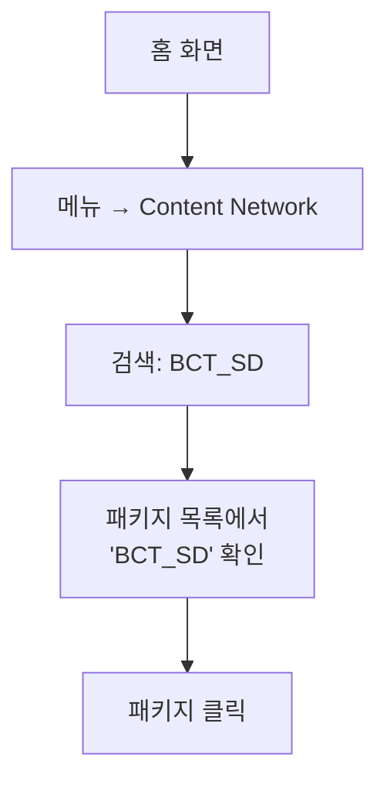
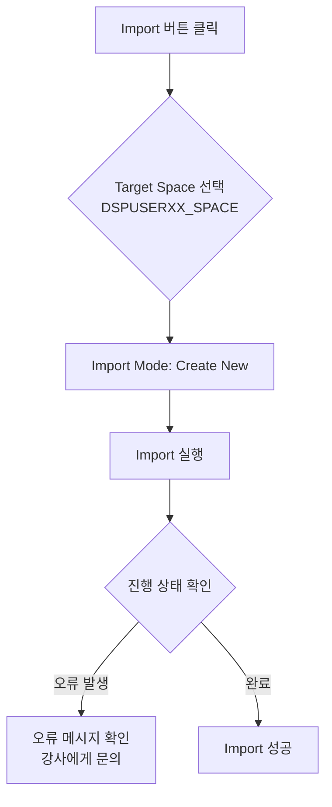
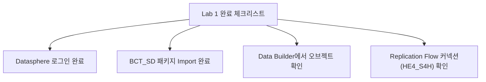
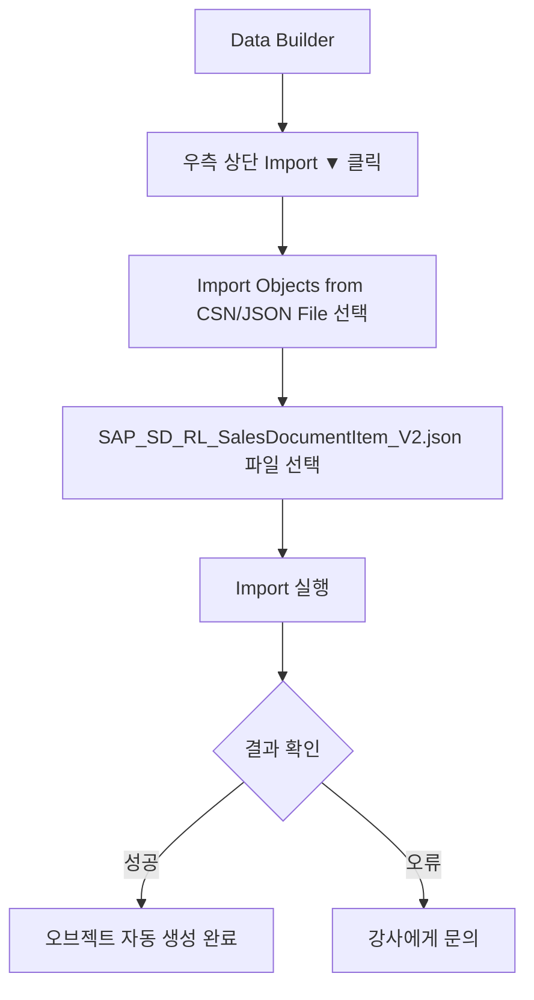

# Lab 1: BCT_SD 표준 컨텐츠 패키지 Import

## 목표

SAP Datasphere의 표준 SD 분석 컨텐츠 패키지 `BCT_SD`를 개인 Space에 Import하여 실습 환경을 구성합니다.

**소요 시간**: 약 20분

---

## 사전 조건

- Datasphere 테넌트 로그인: https://poc-dsp-1.ap12.hcs.cloud.sap/
- 개인 Space (`DSPUSERXX_SPACE`) 접근 권한 확인

---

## 단계별 가이드

### Step 1. Datasphere 로그인

1. 브라우저에서 https://poc-dsp-1.ap12.hcs.cloud.sap/ 접속
2. 로그인 화면에서 계정 정보 입력
   - **사용자 이름**: `sap.dsp.ws.kr+XX@gmail.com` (배정된 계정)
   - **비밀번호**: 

클릭하여 확인
`Welcome1!`

---

### Step 2. 개인 Space 확인

1. 왼쪽 메뉴에서 **Space Management** 클릭
2. 본인 Space(ID: `DSPWSXX`) 확인 (이름: 'DSP Workshop XX')
3. Space 클릭하여 진입

> Tip: Space ID에서 `XX`는 본인 번호입니다 (예: +01 → DSPUSER01_SPACE)

---

### Step 3. Content Network에서 BCT_SD 패키지 검색

1. 왼쪽 상단 메뉴 아이콘 클릭 → **Content Network** 선택
2. 검색창에 `BCT_SD` 입력

---

### Step 4. BCT_SD 패키지 내용 확인

패키지 상세 화면에서 포함된 오브젝트 목록을 확인합니다:

| 오브젝트 타입 | 설명 |
|-------------|------|
| **Local Tables** | SD 마스터/트랜잭션 데이터 저장용 테이블 |
| **Graphical/SQL Views** | 데이터 변환 및 통합 뷰 |
| **Replication Flow** | S/4HANA ODP DataSource 복제 플로우 |
| **Analytic Models** | SD 표준 분석 모델 |

---

### Step 5. 패키지 Import

1. 패키지 화면 우측 상단 **Import** 버튼 클릭
2. Import 설정 화면에서 다음 확인:
   - **Target Space**: `DSP Workshop XX` (본인 Space 선택)
   - **Import Mode**: `Create New` 선택 (기존 오브젝트 없으므로)
3. **Import** 버튼 클릭하여 실행

> Import는 약 30분정도 소요됩니다. 완료될 때까지 대기하세요.

---

### Step 6. Import 결과 확인

1. 왼쪽 메뉴 → **Data Builder** 클릭
2. 본인 Space(`DSPUSERXX_SPACE`) 선택
3. Import된 오브젝트 목록 확인

**확인 항목:**

| 확인 항목 | 예상 결과 |
|----------|----------|
| Local Tables | `SAP_SD_IL_` 접두어로 시작하는 테이블 목록 확인 |
| Replication Flow | `SAP_SD_` 접두어 Replication Flow 확인 |
| SQL Views | `SAP_SD_` 접두어 View 목록 확인 |
| Analytic Models | `SAP_SD_` 접두어 AM 목록 확인 |

---

### Step 7. 커넥션 연결 확인

Import된 Replication Flow가 S/4HANA 커넥션(`HE4_S4H`)에 연결되어 있는지 확인합니다.

1. Data Builder → **Replication Flows** 탭
2. Import된 Replication Flow 클릭하여 열기
3. Source Connection이 `HE4_S4H`로 설정되어 있는지 확인

> 주의: 커넥션이 다른 이름으로 설정된 경우 강사에게 문의하세요.

---

## 확인 포인트

---

## 문제 해결

| 문제 | 해결 방법 |
|------|----------|
| BCT_SD 패키지 검색 안 됨 | Content Network 새로고침 또는 강사 문의 |
| Import 실패 (오류 메시지) | 오류 메시지 캡처 후 강사에게 공유 |
| Target Space 선택 불가 | Space 접근 권한 확인, 강사 문의 |
| Source Connection 불일치 | 강사에게 HE4_S4H 커넥션 할당 요청 |

---

## 다음 단계

Lab 1 완료 후 → **[Lab 2: Replication Flow로 데이터 적재](./lab2-replication-flow.md)** 진행

---

## [대안] Analytic Model JSON 직접 Import

> **이 방법을 사용하는 경우**: 워크샵 참가자가 많아 Content Network를 통한 BCT_SD 패키지 순차 설치에 시간이 너무 오래 걸릴 때 사용합니다.  
> Datasphere는 Analytic Model JSON Import 시 **하위 의존 오브젝트(Local Table, SQL View 등)를 함께 자동 설치**하므로, 최상위 오브젝트 하나만 Import하면 전체 모델이 구성됩니다.

### 사용 파일

아래 링크에서 JSON 파일을 다운로드합니다.

**[⬇️ SAP_SD_RL_SalesDocumentItem_V2.json 다운로드](https://github.com/youngseols925/sap-datasphere-bdc-workshop/raw/main/assets/downloads/SAP_SD_RL_SalesDocumentItem_V2.json)**

> GitHub 페이지가 열리면 브라우저에서 **Ctrl+S** (Mac: Cmd+S) 로 파일 저장, 또는 우클릭 → **다른 이름으로 저장** 하세요.

---

### 대안 Step 1. Data Builder 진입

1. 왼쪽 메뉴 → **Data Builder** 클릭
2. 본인 Space(`DSPWSXX`) 선택

---

### 대안 Step 2. JSON 파일 Import

1. Data Builder 우측 상단 **Import** 버튼(⬇ 아이콘) 클릭
2. **Import Objects from CSN/JSON File** 선택

3. 다운로드한 `SAP_SD_RL_SalesDocumentItem_V2.json` 파일 선택
4. Import 대상 오브젝트 목록 확인 후 **Import** 클릭

---

### 대안 Step 3. Import 결과 확인

Import 완료 후 Data Builder에서 아래 오브젝트가 생성되었는지 확인합니다:

| 확인 항목 | Technical Name 패턴 |
|-----------|-------------------|
| Analytic Model | `SAP_SD_RL_SalesDocumentItem_V2` |
| Fact View (SQL View) | `SAP_SD_HL_*` |
| Local Tables | `SAP_SD_IL_*` |
| Dimension Views | `SAP_SD_*` |

> **Content Network Import 방식과의 차이**: Replication Flow는 포함되지 않습니다.  
> Lab 2의 Replication Flow는 Content Network에서 별도로 Import하거나, 강사가 미리 구성한 공용 Replication Flow를 사용합니다.
