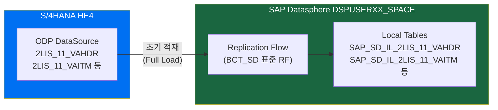
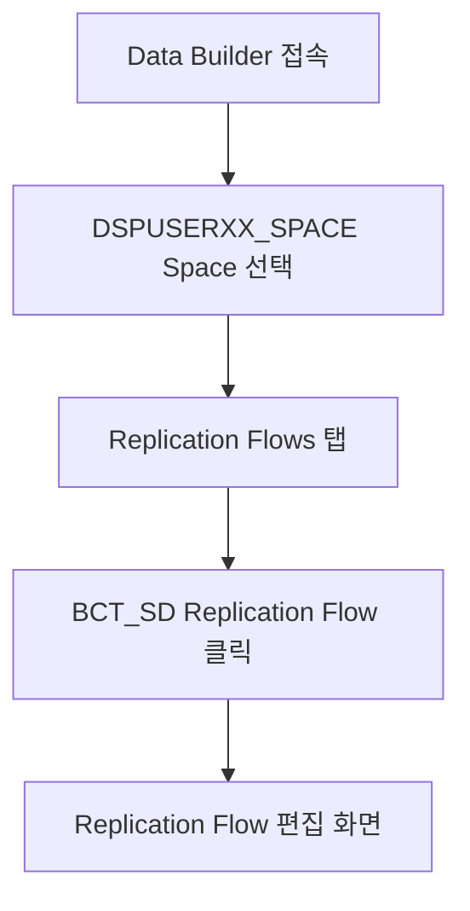
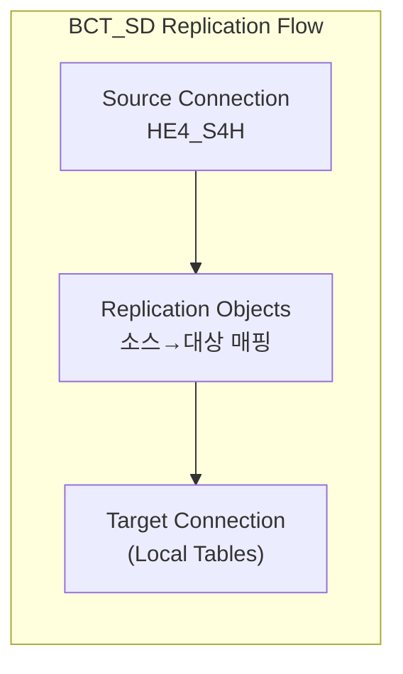
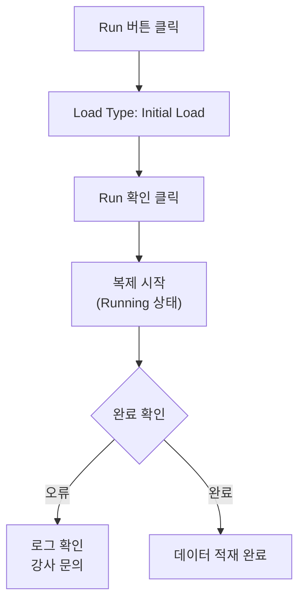
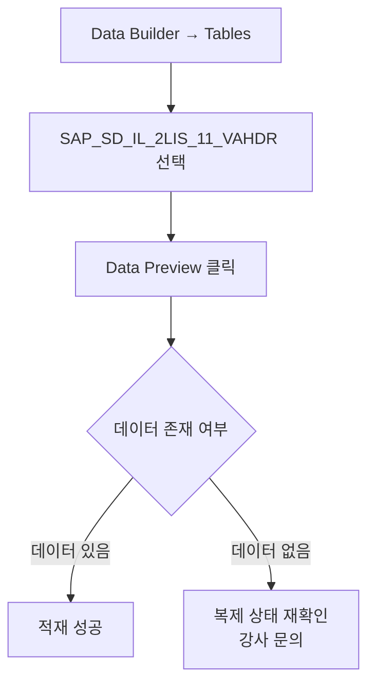
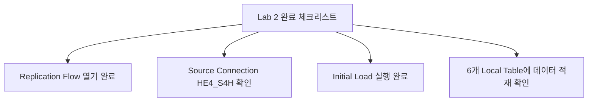

# Lab 2: Replication Flow로 S/4HANA 데이터 적재

## 목표

BCT_SD 패키지에 포함된 **Replication Flow**를 사용하여 S/4HANA(`HE4_S4H`) 시스템의 ODP DataSource 데이터를 개인 Space의 Local Table에 복제합니다.

**소요 시간**: 약 20~30분

---

## 개념 설명

**Replication Flow란?**
- SAP Datasphere의 데이터 복제 도구
- 소스 시스템(S/4HANA)의 데이터를 Datasphere Local Table로 복제
- 초기 적재(Full Load) 및 증분 복제(Delta) 지원

---

## 단계별 가이드

### Step 1. Data Builder에서 Replication Flow 열기

1. 왼쪽 메뉴 → **Data Builder** 클릭
2. 본인 Space(`DSPUSERXX_SPACE`) 선택
3. 오브젝트 목록에서 **Replication Flows** 탭 클릭
4. Lab 1에서 Import된 BCT_SD Replication Flow 선택하여 열기

---

### Step 2. Replication Flow 구성 확인

Replication Flow 편집 화면에서 다음 항목을 확인합니다:

**확인 항목:**

| 항목 | 예상 값 |
|------|--------|
| Source Connection | `HE4_S4H` |
| Source Type | `ABAP (ODP)` |
| Replication Mode | `Initial and Delta` |

> 주의: Source Connection이 다르게 보인다면 강사에게 문의하세요.

---

### Step 3. Replication Objects 확인

화면 하단 또는 중간 패널에서 복제 대상 오브젝트 목록 확인:

| 소스 ODP DataSource | 대상 Local Table | 설명 |
|--------------------|-----------------|------|
| `2LIS_11_VAHDR` | `SAP_SD_IL_2LIS_11_VAHDR` | 수주 헤더 |
| `2LIS_11_VAITM` | `SAP_SD_IL_2LIS_11_VAITM` | 수주 아이템 |
| `2LIS_11_VASCL` | `SAP_SD_IL_2LIS_11_VASCL` | 납품일정행 (확정수량) |
| `2LIS_12_VCITM` | `SAP_SD_IL_2LIS_12_VCITM` | 납품 아이템 (출고수량) |
| `2LIS_13_VDITM` | `SAP_SD_IL_2LIS_13_VDITM` | 청구 아이템 |
| `2LIS_13_VDHDR` | `SAP_SD_IL_2LIS_13_VDHDR` | 청구 헤더 |

> 실제 목록은 BCT_SD 패키지 버전에 따라 다를 수 있습니다.

---

### Step 4. Replication Flow 실행 (Run)

1. 화면 상단 **Run** 버튼 클릭
2. 실행 옵션 확인:
   - **Load Type**: `Initial Load` (처음 실행이므로)
3. **Run** 클릭하여 복제 시작

> 데이터 양에 따라 5~15분 소요될 수 있습니다.

---

### Step 5. 실행 상태 모니터링

1. Replication Flow 화면에서 **Monitor** 탭 클릭 (또는 별도 모니터링 메뉴)
2. 각 오브젝트별 복제 상태 확인:

| 상태 | 의미 |
|------|------|
| **Running** | 복제 진행 중 |
| **Completed** | 복제 완료 |
| **Failed** | 오류 발생 |

---

### Step 6. 적재 데이터 확인

복제 완료 후 Local Table에 데이터가 적재되었는지 확인합니다.

1. Data Builder → **Tables** 탭
2. `SAP_SD_IL_2LIS_11_VAHDR` 클릭하여 열기
3. 테이블 상단 **Data Preview** 버튼 클릭
4. 데이터 조회 확인

**Data Preview 확인 포인트:**
- 판매 오더 번호(`VBELN`) 데이터 확인
- 생성일자(`ERDAT`) 범위 확인
- 데이터 건수 확인 (우측 하단)

---

### Step 7. 주요 테이블 데이터 확인

각 Local Table의 데이터를 확인합니다:

| 테이블 | 확인 항목 |
|--------|---------|
| `SAP_SD_IL_2LIS_11_VAHDR` | 수주 헤더 (VBELN, VKORG, KUNNR 등) |
| `SAP_SD_IL_2LIS_11_VAITM` | 수주 아이템 (POSNR, MATNR, KWMENG 등) |
| `SAP_SD_IL_2LIS_11_VASCL` | 납품일정행 (확정수량 BMENG) |
| `SAP_SD_IL_2LIS_12_VCITM` | 납품 아이템 (출고수량 LFIMG) |
| `SAP_SD_IL_2LIS_13_VDITM` | 청구 아이템 (청구수량/금액) |
| `SAP_SD_IL_2LIS_13_VDHDR` | 청구 헤더 (청구유형 FKART) |

---

## 확인 포인트

---

## 문제 해결

| 문제 | 해결 방법 |
|------|----------|
| Run 버튼 비활성화 | 저장 후 재시도, 또는 편집 모드 확인 |
| `Failed` 상태 | 로그 메시지 확인 및 강사 문의 |
| 데이터 미적재 | 복제 완료 후 Data Preview 새로고침 |
| 커넥션 오류 | HE4_S4H 커넥션 상태 확인 |

---

## 다음 단계

Lab 2 완료 후 → **[Lab 3: 표준 Analytic Model로 데이터 확인](./lab3-standard-analytic-model.md)** 진행
