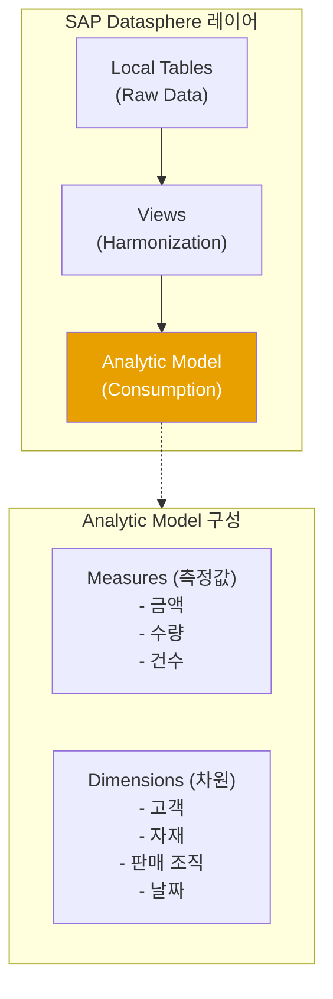
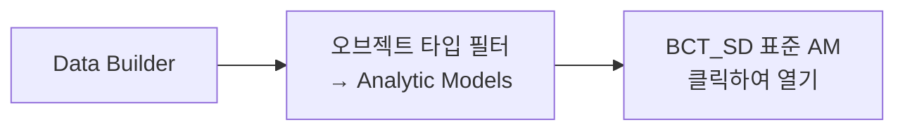
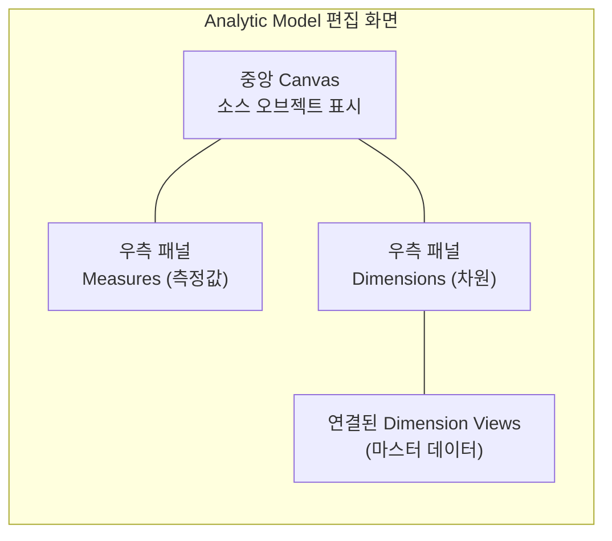
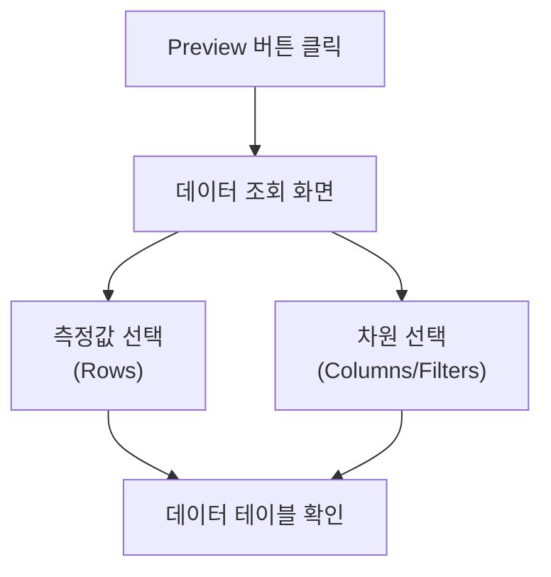
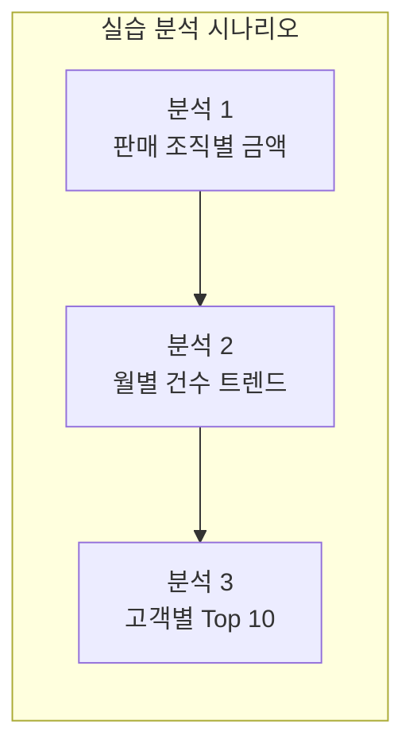
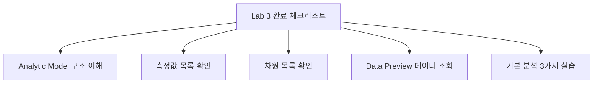
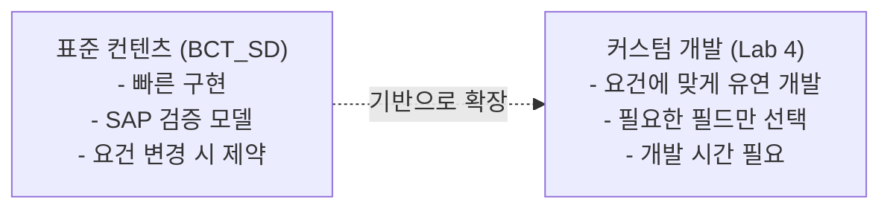

# Lab 3: 표준 Analytic Model로 데이터 확인

## 목표

BCT_SD 패키지에서 제공하는 **표준 Analytic Model**을 활용하여 S/4HANA SD 데이터를 분석합니다.
Analytic Model의 구조(측정값, 차원)를 이해하고 데이터를 조회해봅니다.

**소요 시간**: 약 20분

---

## 개념 설명

**Analytic Model이란?**
- SAP Datasphere의 데이터 소비(Consumption) 레이어
- 비즈니스 측정값(Measures)과 분석 차원(Dimensions) 정의
- SAP Analytics Cloud 및 Excel 등 BI 도구와 연결

---

## 단계별 가이드

### Step 1. Analytic Model 찾기

1. Data Builder → 왼쪽 상단 오브젝트 타입 필터
2. **Analytic Models** 선택
3. BCT_SD 패키지에서 Import된 표준 AM 클릭 (이름은 패키지 버전에 따라 상이)

> Tip: BCT_SD 패키지에 포함된 Analytic Model 이름은 패키지 버전에 따라 다를 수 있습니다. `SAP_SD_` 접두어로 시작하는 AM을 선택하세요.

---

### Step 2. Analytic Model 구조 파악

편집 화면에서 다음 패널을 확인합니다:

**확인 항목:**

| 패널 | 확인 내용 |
|------|---------|
| Source | 연결된 Fact View 이름 |
| Measures | 금액, 수량 등 측정값 목록 |
| Dimensions | 고객, 자재, 날짜 등 차원 목록 |
| Associations | 마스터 데이터 연결 확인 |

---

### Step 3. 측정값(Measures) 확인

Measures 패널에서 각 측정값의 속성 확인:

| 측정값 | 타입 | 집계 방식 |
|--------|------|---------|
| 청구 금액 | BASE | SUM |
| 청구 수량 | BASE | SUM |
| 건수 | CALCULATED | COUNT |

**측정값 타입 설명:**
- **BASE**: 소스 필드를 직접 집계
- **CALCULATED**: 다른 측정값을 조합하여 계산
- **RESTRICTED**: 특정 조건으로 필터링된 측정값

---

### Step 4. 차원(Dimensions) 확인

Dimensions 패널에서 각 차원의 속성 확인:

| 차원 | 연결 오브젝트 | 설명 |
|------|------------|------|
| 고객 | 고객 Dimension View | 고객 마스터 (이름, 지역 등) |
| 자재 | 자재 Dimension View | 자재 마스터 (자재명, 자재그룹) |
| 판매 조직 | - | 판매 조직 코드 |
| 날짜 | 날짜 Dimension | 연/분기/월/일 계층 |

---

### Step 5. Data Preview로 데이터 확인

1. Analytic Model 화면 상단 **Preview** 버튼 클릭
2. 데이터 조회 화면 열림

**Preview 조작 방법:**

| 작업 | 방법 |
|------|------|
| 차원 추가 | 좌측 차원 목록에서 드래그 또는 클릭 |
| 측정값 추가 | 좌측 측정값 목록에서 드래그 또는 클릭 |
| 필터 적용 | 차원 옆 필터 아이콘 클릭 |
| 데이터 정렬 | 컬럼 헤더 클릭 |

---

### Step 6. 기본 분석 실습

다음 분석을 차례로 실습합니다:

#### 분석 1: 판매 조직별 청구 금액 합계

- 행(Row): 판매 조직
- 측정값: 청구 금액
- 결과 확인: 판매 조직별 금액 비교

#### 분석 2: 월별 청구 건수 트렌드

- 행(Row): 청구 날짜 (월 레벨)
- 측정값: 청구 건수
- 결과 확인: 월별 청구 추이 확인

#### 분석 3: 고객별 Top 10 분석

- 행(Row): 고객
- 측정값: 청구 금액
- 정렬: 청구 금액 내림차순
- 결과 확인: 상위 고객 식별

---

### Step 7. 마스터 데이터 연결 확인 (텍스트 표시)

Analytic Model에서 차원에 마스터 데이터가 연결되면 코드 대신 텍스트로 표시됩니다.

- 고객 코드 `0000001000` → 고객명 표시 여부 확인
- 자재 코드 → 자재명 표시 여부 확인

> 마스터 데이터가 연결되지 않은 경우 코드만 표시됩니다.

---

## 확인 포인트

---

## 표준 컨텐츠 vs 커스텀 개발 비교

---

## 다음 단계

Lab 3 완료 후 → 점심 식사 후 → **[Lab 4-A: ODP 기반 커스텀 모델 개발](./lab4a-odp-fact-view-am.md)** 진행
