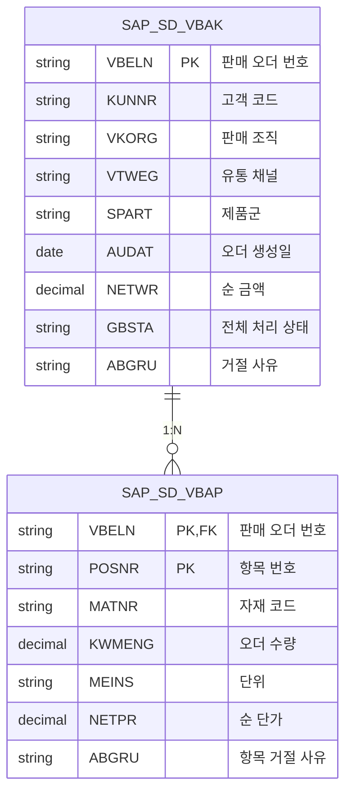
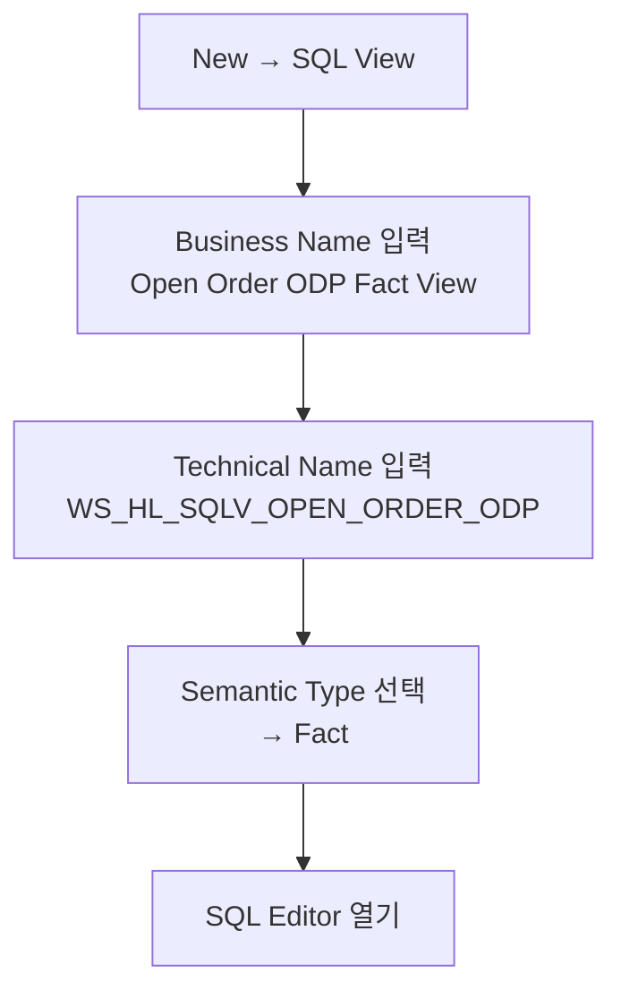
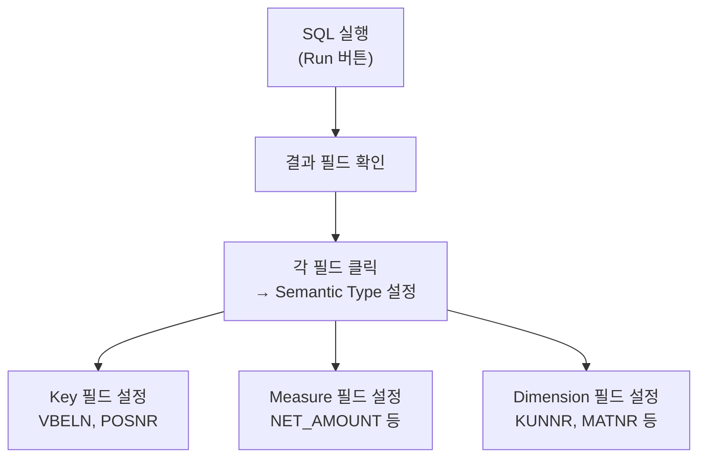
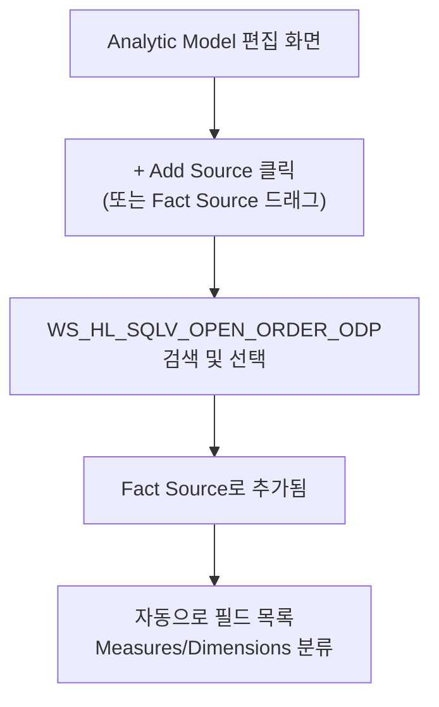
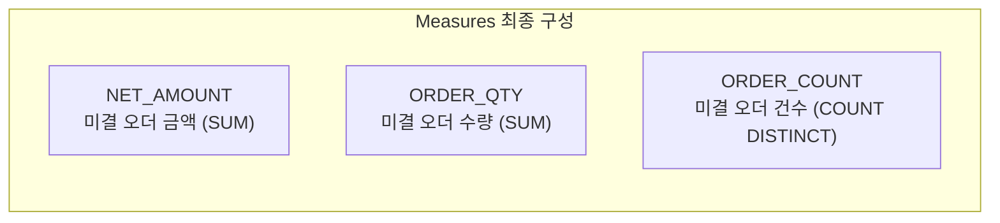
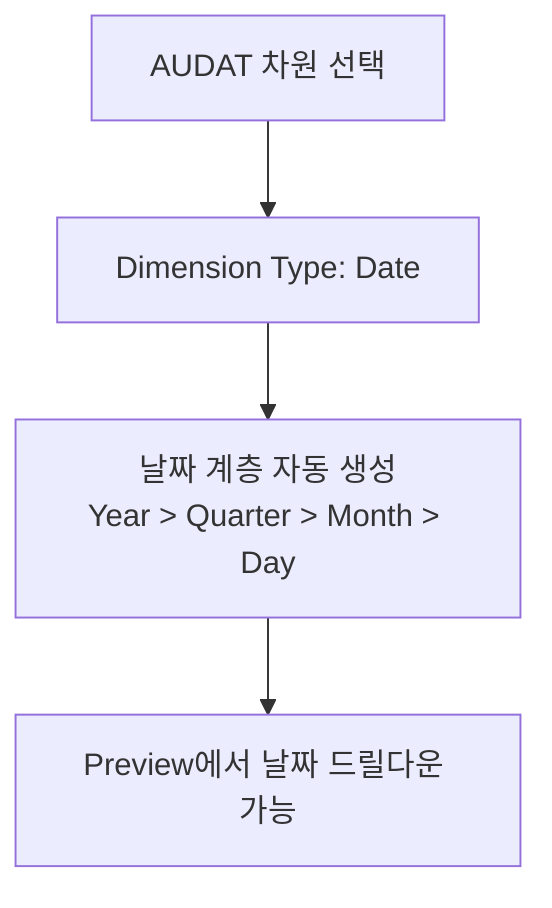
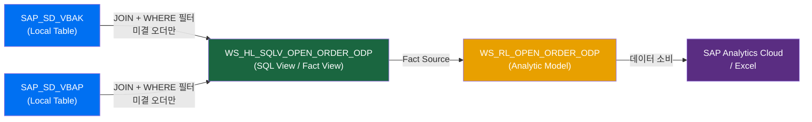
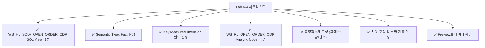

# Lab 4-A: ODP 기반 Open Order Fact View & Analytic Model

## 목표

S/4HANA ODP DataSource를 소스로 한 Local Table을 기반으로 **미결 판매 오더 Fact View**와 **Analytic Model**을 직접 개발합니다.

**소요 시간**: 약 60분

---

## 개발 목표 오브젝트

| 오브젝트 | ID | 설명 |
|---------|-----|------|
| SQL View (Fact View) | `WS_HL_SQLV_OPEN_ORDER_ODP` | ODP 기반 미결 오더 Fact View |
| Analytic Model | `WS_RL_OPEN_ORDER_ODP` | ODP 기반 미결 오더 분석 모델 |

---

## 소스 데이터 구조



---

## Part A. Fact View 생성

### Step A-1. SQL View 오브젝트 생성

1. Data Builder → **New** 버튼 클릭
2. **SQL View** 선택
3. 기본 속성 설정:



**오브젝트 속성:**

| 속성 | 값 |
|------|-----|
| Business Name | `Open Order ODP Fact View` |
| Technical Name | `WS_HL_SQLV_OPEN_ORDER_ODP` |
| Semantic Type | `Fact` |

---

### Step A-2. SQL 작성

SQL Editor에 다음 쿼리를 입력합니다:

```sql
SELECT
    -- 키 필드
    H.VBELN,
    I.POSNR,
    -- 차원 필드 (Dimensions)
    H.KUNNR,
    H.VKORG,
    H.VTWEG,
    H.SPART,
    H.AUDAT,
    I.MATNR,
    I.MEINS,
    -- 측정값 (Measures)
    H.NETWR        AS NET_AMOUNT,
    I.KWMENG       AS ORDER_QTY,
    I.NETPR        AS NET_PRICE,
    -- 상태 필드
    H.GBSTA,
    H.ABGRU        AS HDR_REASON_REJECTION,
    I.ABGRU        AS ITM_REASON_REJECTION

FROM SAP_SD_VBAK AS H
INNER JOIN SAP_SD_VBAP AS I
    ON H.VBELN = I.VBELN

WHERE
    -- 미결 오더 필터: 완전히 처리되지 않은 오더만
    (H.GBSTA IS NULL OR H.GBSTA <> 'C')
    AND H.ABGRU IS NULL
    AND I.ABGRU IS NULL
```

> 💡 테이블 이름은 실제 BCT_SD Import된 오브젝트 이름에 맞게 수정하세요.

---

### Step A-3. 필드 속성 설정

SQL 실행 후 결과 필드에 Semantic Type을 설정합니다:

| 필드 | Semantic Type | 설명 |
|------|-------------|------|
| `VBELN` | **Key** | 판매 오더 번호 (Primary Key) |
| `POSNR` | **Key** | 판매 오더 항목 번호 (Primary Key) |
| `KUNNR` | **Dimension** | 고객 (텍스트 없음 → 마스터 연결 예정) |
| `VKORG` | **Dimension** | 판매 조직 |
| `VTWEG` | **Dimension** | 유통 채널 |
| `SPART` | **Dimension** | 제품군 |
| `AUDAT` | **Dimension** | 오더 생성일 (Date) |
| `MATNR` | **Dimension** | 자재 코드 |
| `NET_AMOUNT` | **Measure** | 순 금액 |
| `ORDER_QTY` | **Measure** | 오더 수량 |
| `NET_PRICE` | **Measure** | 순 단가 |



---

### Step A-4. 데이터 Preview 확인

1. 화면 상단 **Preview** 버튼 클릭
2. 미결 오더 데이터 확인
3. 레코드 수 및 주요 필드 값 확인

---

### Step A-5. 저장

1. 화면 상단 **Save** 버튼 클릭 (또는 Ctrl+S)
2. 저장 확인 메시지 확인

---

## Part B. Analytic Model 생성

### Step B-1. Analytic Model 오브젝트 생성

1. Data Builder → **New** 버튼 클릭
2. **Analytic Model** 선택
3. 기본 속성 설정:

| 속성 | 값 |
|------|-----|
| Business Name | `Open Order ODP Analytic Model` |
| Technical Name | `WS_RL_OPEN_ORDER_ODP` |

---

### Step B-2. Fact Source 연결



---

### Step B-3. 측정값(Measures) 구성

Measures 패널에서 다음 측정값을 설정합니다:

#### BASE 측정값

| 측정값 ID | Business Name | 소스 필드 | 집계 |
|----------|-------------|---------|------|
| `NET_AMOUNT` | 미결 오더 금액 | `NET_AMOUNT` | SUM |
| `ORDER_QTY` | 미결 오더 수량 | `ORDER_QTY` | SUM |

#### CALCULATED 측정값 추가

**오더 건수** (고유 오더 번호 기준):

1. Measures 패널 → **+ Add Measure** 클릭
2. **Calculated Measure** 선택
3. 설정:

```
Measure ID: ORDER_COUNT
Business Name: 미결 오더 건수
Formula: COUNT(DISTINCT VBELN)
```



---

### Step B-4. 차원(Dimensions) 구성

Dimensions 패널에서 다음 차원을 활성화합니다:

| 차원 | 차원 활성화 여부 | Dimension View 연결 |
|------|--------------|-----------------|
| `KUNNR` | ✅ 활성화 | (선택) 고객 마스터 View |
| `MATNR` | ✅ 활성화 | (선택) 자재 마스터 View |
| `VKORG` | ✅ 활성화 | - |
| `VTWEG` | ✅ 활성화 | - |
| `SPART` | ✅ 활성화 | - |
| `AUDAT` | ✅ 활성화 | (추천) 날짜 차원 연결 |

---

### Step B-5. 날짜 차원 연결 (AUDAT)

`AUDAT` 필드에 날짜 계층(연/분기/월/일)을 추가합니다:



---

### Step B-6. 미결 오더 필터 추가 (선택 사항)

Analytic Model 레벨에서 추가 필터를 설정합니다:

1. 상단 **Filters** 탭 클릭 (또는 Filter 패널)
2. **+ Add Filter** 클릭
3. `GBSTA` 필드에 필터 추가: `≠ 'C'`

---

### Step B-7. 저장 및 Preview

1. **Save** 버튼 클릭
2. **Preview** 버튼 클릭하여 데이터 확인

**검증 시나리오:**

| 분석 | 확인 내용 |
|------|----------|
| 판매 조직별 미결 오더 금액 | 조직별 합계 금액 확인 |
| 월별 미결 오더 건수 | 날짜 계층 드릴다운 확인 |
| 고객별 미결 오더 수량 | 상위 고객 확인 |

---

## 전체 흐름 정리



---

## 완료 체크리스트



---

## 다음 단계

✅ Lab 4-A 완료 후 → **[Lab 4-B: CDS View 기반 모델 개발](./lab4b-cdsv-fact-view-am.md)** 진행
