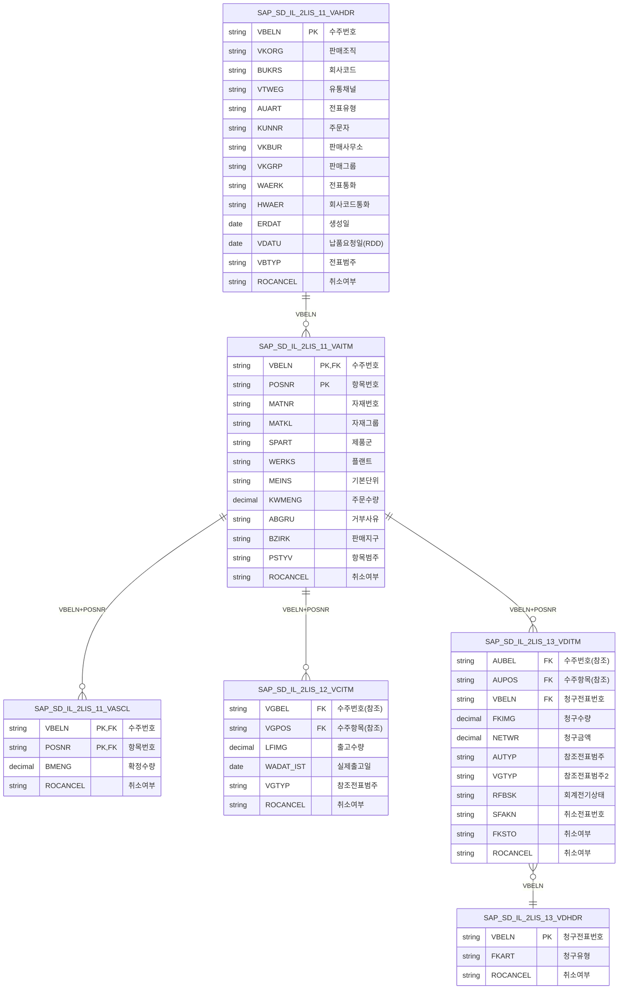
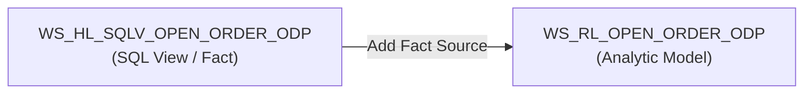
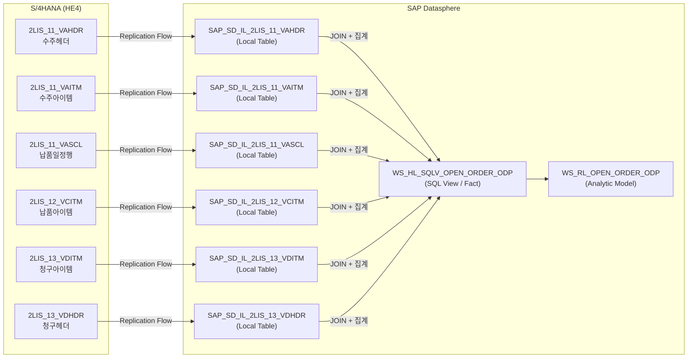

# Lab 4-A: ODP 기반 Open Order Fact View & Analytic Model

## 목표

S/4HANA ODP DataSource를 Replication Flow로 복제한 **Local Table**을 소스로, 미결 판매 오더를 분석하는 **Fact View**와 **Analytic Model**을 개발합니다.

**소요 시간**: 약 60분

---

## 개발 오브젝트

| 오브젝트 | Technical Name | 소스 |
|---------|----------------|------|
| SQL View (Fact View) | `WS_HL_SQLV_OPEN_ORDER_ODP` | Local Tables (ODP 복제) |
| Analytic Model | `WS_RL_OPEN_ORDER_ODP` | `WS_HL_SQLV_OPEN_ORDER_ODP` |

---

## 소스 데이터 구조

Lab 2에서 Replication Flow로 복제된 Local Table 6개를 사용합니다.



---

## Part A. Fact View 생성

### Step A-1. SQL View 생성

1. Data Builder → **New** → **SQL View**
2. 기본 속성 설정:

| 속성 | 값 |
|------|-----|
| Business Name | `Open Order ODP Fact View` |
| Technical Name | `WS_HL_SQLV_OPEN_ORDER_ODP` |
| Semantic Usage | `Fact` |

### Step A-2. SQL 작성

SQL Editor에 아래 쿼리를 입력합니다.

<details>
<summary>정답 보기 — 먼저 스스로 작성해 본 후 확인하세요</summary>

```sql
SELECT 
-- 헤더
    H.VBELN,
    H.ERDAT,
    TO_VARCHAR(H.ERDAT, 'YYYYMM')                       AS CalendarYearMonth,
    H.VDATU,
    H.VKORG,
    H.BUKRS,
    H.VTWEG,
    H.AUART,
    H.KUNNR,
    H.VKBUR,
    H.VKGRP,
    H.WAERK,
    H.HWAER,
    H.VBTYP, 
-- 아이템
    I.POSNR,
    I.MATNR,
    I.MATKL,
    I.SPART,
    I.WERKS,
    I.MEINS,
    I.PSTYV,
    I.ABGRU,
    I.BZIRK, 
-- 4대 지표
    I.KWMENG,
    COALESCE(C.CONFIRMED_QTY, 0)                        AS CONFIRMED_QTY,
    COALESCE(G.GI_QTY, 0)                               AS GI_QTY,
    G.GI_DATE,
    COALESCE(B.BILL_QTY, 0)                             AS BILL_QTY,
    COALESCE(B.BILL_AMT, 0)                             AS BILL_AMT, 
-- 파생 지표
    I.KWMENG - COALESCE(G.GI_QTY, 0)                   AS OPEN_DLV_QTY,
    COALESCE(G.GI_QTY, 0) - COALESCE(B.BILL_QTY, 0)   AS UNBILLED_QTY, 
-- (1) 납품진행상태
    CASE
        WHEN G.GI_DATE IS NULL THEN 'Not Started'
        WHEN (I.KWMENG - COALESCE(G.GI_QTY, 0)) > 0
             AND G.GI_DATE IS NOT NULL THEN 'In Progress'
        ELSE 'Completed'
    END                                                  AS DELIVERY_STATUS, 
-- (2) 비교기준일
    CASE
        WHEN G.GI_DATE IS NOT NULL
             AND (I.KWMENG - COALESCE(G.GI_QTY, 0)) <= 0 THEN G.GI_DATE
        ELSE CURRENT_DATE
    END                                                  AS COMPARISON_DATE, 
-- (3) Lead-time (납품요청일 기준)
    CASE
        WHEN G.GI_DATE IS NOT NULL
             AND (I.KWMENG - COALESCE(G.GI_QTY, 0)) <= 0
            THEN DAYS_BETWEEN(H.VDATU, G.GI_DATE)
        ELSE DAYS_BETWEEN(H.VDATU, CURRENT_DATE)
    END                                                  AS RDD_LEADTIME_DAYS, 
-- (4) RDD 준수여부
    CASE
        WHEN G.GI_DATE IS NOT NULL
             AND (I.KWMENG - COALESCE(G.GI_QTY, 0)) <= 0
            THEN CASE
                     WHEN DAYS_BETWEEN(H.VDATU, G.GI_DATE) <= 0 THEN 'On-Time'
                     ELSE 'Delay'
                 END
        ELSE CASE
                 WHEN DAYS_BETWEEN(H.VDATU, CURRENT_DATE) <= 0 THEN 'On-Time'
                 ELSE 'Delay'
             END
    END                                                  AS RDD_COMPLIANCE 

-- 수주 헤더 (메인)
FROM "SAP_SD_IL_2LIS_11_VAHDR" H 

-- 수주 아이템
    INNER JOIN "SAP_SD_IL_2LIS_11_VAITM" I
        ON H.VBELN = I.VBELN AND I.ROCANCEL = '' 

-- 확정수량 (납품일정행)
    LEFT JOIN (
        SELECT VBELN, POSNR,
               SUM(BMENG) AS CONFIRMED_QTY
        FROM "SAP_SD_IL_2LIS_11_VASCL"
        WHERE ROCANCEL = ''
        GROUP BY VBELN, POSNR
    ) C ON I.VBELN = C.VBELN AND I.POSNR = C.POSNR 

-- 출하수량 / 실출하일
    LEFT JOIN (
        SELECT VGBEL AS SO_VBELN,
               VGPOS AS SO_POSNR,
               SUM(LFIMG)       AS GI_QTY,
               MAX(WADAT_IST)   AS GI_DATE
        FROM "SAP_SD_IL_2LIS_12_VCITM"
        WHERE ROCANCEL = '' AND VGTYP = 'C'
        GROUP BY VGBEL, VGPOS
    ) G ON I.VBELN = G.SO_VBELN AND I.POSNR = G.SO_POSNR 

-- 청구수량 / 청구금액
    LEFT JOIN (
        SELECT I2.AUBEL AS SO_VBELN,
               I2.AUPOS AS SO_POSNR,
               SUM(CASE WHEN I2.AUTYP IN ('H','K') OR I2.VGTYP = 'T'
                        THEN I2.FKIMG * -1 ELSE I2.FKIMG END) AS BILL_QTY,
               SUM(CASE WHEN I2.AUTYP IN ('H','K') OR I2.VGTYP = 'T'
                        THEN I2.NETWR * -1 ELSE I2.NETWR END) AS BILL_AMT
        FROM "SAP_SD_IL_2LIS_13_VDITM" I2
            INNER JOIN "SAP_SD_IL_2LIS_13_VDHDR" H2 ON I2.VBELN = H2.VBELN
        WHERE I2.ROCANCEL = ''
          AND H2.ROCANCEL = ''
          AND H2.FKART NOT IN ('IV', 'IG')        -- Intercompany Invoice/Credit Memo 제외
          AND (I2.RFBSK IS NULL OR I2.RFBSK = '')
          AND (I2.SFAKN IS NULL OR I2.SFAKN = '')
          AND (I2.FKSTO IS NULL OR I2.FKSTO = '')
          AND I2.AUTYP = 'C'
        GROUP BY I2.AUBEL, I2.AUPOS
    ) B ON I.VBELN = B.SO_VBELN AND I.POSNR = B.SO_POSNR

-- 메인 WHERE절
WHERE H.VKORG NOT IN ('7600', '7700')   -- 제외 판매조직
  AND H.VBTYP = 'C'                     -- 수주 전표만
  AND H.ROCANCEL = ''                   -- 취소 제외
  AND (I.ABGRU = '' OR I.ABGRU IS NULL) -- 거부 제외
```

</details>

> 핵심 필터 포인트:
> - `ROCANCEL = ''` : 취소된 레코드 제외 (ODP 핵심 조건)
> - `VBTYP = 'C'` : 수주 전표 유형만 포함
> - `ABGRU = ''` : 거부되지 않은 아이템만

### Step A-3. 필드 속성 설정 (Semantic Type)

SQL 실행 후 Output 패널에서 각 필드의 Semantic Type을 설정합니다:

| 필드 | Semantic Type | Business Name |
|------|-------------|---------------|
| `VBELN` | Key | 영업전표번호 |
| `POSNR` | Key | 항목번호 |
| `ERDAT` | Attribute (Date) | 생성일 |
| `CalendarYearMonth` | Attribute | 생성년월 |
| `VDATU` | Attribute (Date) | 납품요청일 |
| `VKORG` | Attribute | 판매조직 |
| `BUKRS` | Attribute | 회사코드 |
| `KUNNR` | Attribute | 주문자 |
| `MATNR` | Attribute | 자재번호 |
| `KWMENG` | Measure | 주문수량 |
| `CONFIRMED_QTY` | Measure | 확정수량 |
| `GI_QTY` | Measure | 출고수량 |
| `BILL_QTY` | Measure | 청구수량 |
| `BILL_AMT` | Measure | 청구금액 |
| `OPEN_DLV_QTY` | Measure | 미납품수량 |
| `UNBILLED_QTY` | Measure | 미청구수량 |
| `RDD_LEADTIME_DAYS` | Measure | 리드타임(일) |

### Step A-4. Preview 및 저장

1. **Preview** 버튼 클릭 → 데이터 확인
2. **Save** 클릭 (Ctrl+S)

---

## Part B. Analytic Model 생성

### Step B-1. Analytic Model 생성

1. Data Builder → **New** → **Analytic Model**
2. 기본 속성:

| 속성 | 값 |
|------|-----|
| Business Name | `Open Order ODP AM` |
| Technical Name | `WS_RL_OPEN_ORDER_ODP` |

### Step B-2. Fact Source 연결



Add Source 버튼 클릭 → `WS_HL_SQLV_OPEN_ORDER_ODP` 검색 후 선택

### Step B-3. Measures 구성

Fact View의 수치 필드가 자동으로 Measures로 인식됩니다.

**BASE Measures (집계 기본값: SUM)**

| Measure | Business Name |
|---------|--------------|
| `KWMENG` | 주문수량 |
| `CONFIRMED_QTY` | 확정수량 |
| `GI_QTY` | 출고수량 |
| `BILL_QTY` | 청구수량 |
| `BILL_AMT` | 청구금액 |
| `OPEN_DLV_QTY` | 미납품수량 |
| `UNBILLED_QTY` | 미청구수량 |

**RESTRICTION Measures** (기간 비교 분석용)

Variables(변수)와 연동되어 기간별 필터링을 수행합니다:

| Measure | 설명 |
|---------|------|
| `Measure_Value` | 전체 (필터 없음) |
| `01_CURR_MONTH` | 당월 (`CalendarYearMonth = RV_CURR_MONTH`) |
| `02_PRE_MONTH` | 전월 (`CalendarYearMonth = RV_PREVIOUS_MONTH`) |
| `03_CURRENT_YEAR_CUMUL` | 당년 누계 (`RV_CURR_YEAR_JAN` ~ `RV_CURR_MONTH`) |
| `04_PRE_YEAR_CUM` | 전년 누계 (`RV_PREVIOUS_YEAR_JAN` ~ `RV_PREVIOUS_YEAR_SAME_MONTH`) |
| `05_PRE_SAME_MONTH` | 전년동기 (`CalendarYearMonth = RV_PREVIOUS_YEAR_SAME_MONTH`) |

### Step B-4. Variables (변수) 구성

RESTRICTION Measures에서 참조하는 Variables 6개:

| Variable | 설명 | 기본값 |
|----------|------|--------|
| `P_MONTH` | 기준월 (사용자 입력) | `202501` |
| `RV_PREVIOUS_MONTH` | 전월 (자동 계산) | `V_MONTH_COMPARISON` 참조 |
| `RV_CURR_MONTH` | 당월 | `V_MONTH_COMPARISON` 참조 |
| `RV_CURR_YEAR_JAN` | 당년 1월 | `V_MONTH_COMPARISON` 참조 |
| `RV_PREVIOUS_YEAR_SAME_MONTH` | 전년동기월 | `V_MONTH_COMPARISON` 참조 |
| `RV_PREVIOUS_YEAR_JAN` | 전년 1월 | `V_MONTH_COMPARISON` 참조 |

> `P_MONTH`에 기준월(YYYYMM)을 입력하면 나머지 5개 변수가 자동으로 계산됩니다.

### Step B-5. Dimension 연결 (자재 마스터)

`MATNR` 필드에 `SAP_LO_Product_V2` Dimension View를 연결하여 자재명 등 텍스트 속성을 사용할 수 있게 합니다.

1. Dimensions 패널에서 `MATNR` 선택
2. Association 설정: `MATNR` → `SAP_LO_Product_V2.Product`

### Step B-6. 저장 및 Preview

1. **Save** 클릭
2. **Preview** 클릭
3. `P_MONTH` 변수 입력 (예: `202501`) → 데이터 확인

**검증 포인트:**

| 확인 항목 | 기대 결과 |
|----------|---------|
| Structure Members 패널 | RESTRICTION 6개 표시 |
| Variables 패널 | P_MONTH 등 6개 표시 |
| Preview 데이터 | 당월/전월/누계 수치 비교 가능 |

---

## 전체 데이터 흐름



---

## 완료 체크리스트

- [ ] `WS_HL_SQLV_OPEN_ORDER_ODP` SQL View 생성 (Semantic Usage: Fact)
- [ ] SQL 정상 실행 확인 (Run 버튼)
- [ ] Key/Measure/Attribute Semantic Type 설정
- [ ] Preview 데이터 확인
- [ ] `WS_RL_OPEN_ORDER_ODP` Analytic Model 생성
- [ ] Fact Source 연결 확인
- [ ] Structure Members (RESTRICTION 6개) 표시 확인
- [ ] Variables (6개) 표시 확인
- [ ] P_MONTH 입력 후 Preview 정상 동작 확인

---

다음 단계 → **[Lab 4-B: CDS View 기반 모델 개발](./lab4b-cdsv-fact-view-am.md)**
