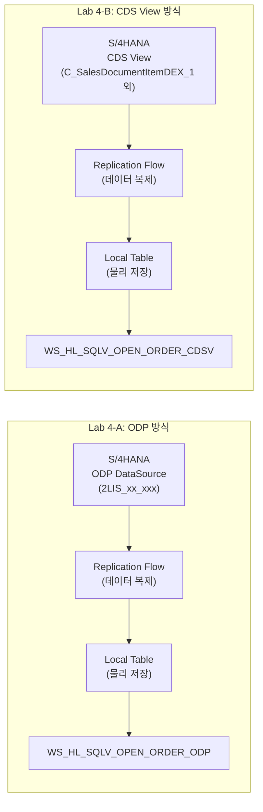
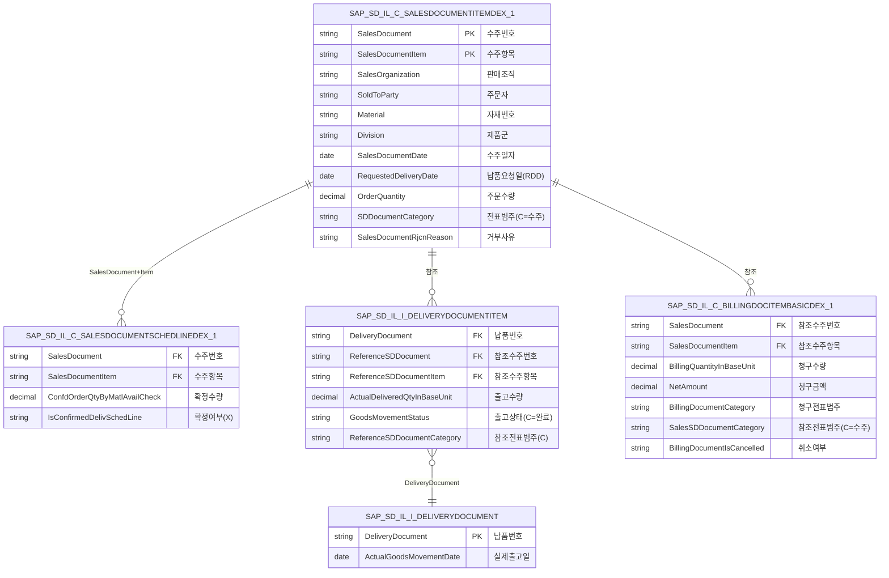
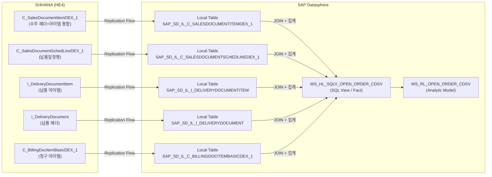

# Lab 4-B: CDS View 기반 Open Order Fact View & Analytic Model

## 목표

S/4HANA **CDS View**를 Replication Flow로 복제한 **Local Table**을 소스로, **미결 판매 오더 Fact View**와 **Analytic Model**을 개발합니다.
Lab 4-A(ODP 방식)와 동일한 비즈니스 로직을 구현하며, 두 방식의 아키텍처 차이를 이해합니다.

**소요 시간**: 약 60분

---

## 개발 오브젝트

| 오브젝트 | Technical Name | 소스 |
|---------|----------------|------|
| SQL View (Fact View) | `WS_HL_SQLV_OPEN_ORDER_CDSV` | Local Tables (CDS View 복제) |
| Analytic Model | `WS_RL_OPEN_ORDER_CDSV` | `WS_HL_SQLV_OPEN_ORDER_CDSV` |

---

## ODP 방식 vs CDS View 방식 비교



| 비교 항목 | ODP (Lab 4-A) | CDS View (Lab 4-B) |
|----------|--------------|-------------------|
| 복제 방식 | Replication Flow (ODP DataSource) | Replication Flow (CDS View) |
| 데이터 저장 | Local Table (물리 복제) | Local Table (물리 복제) |
| 소스 타입 | ODP DataSource (2LIS_xx_xxx) | S/4HANA CDS View |
| 소스 테이블 수 | 6개 (헤더/아이템 분리) | 5개 (일부 통합 CDS View) |
| 핵심 필터 차이 | `ROCANCEL=''` (취소 레코드 제외) | `SDDocumentCategory='C'` |

---

## 소스 CDS View 구조

CDS View는 ODP DataSource와 달리 S/4HANA에서 이미 통합/가공된 데이터를 제공합니다.



---

## Part A. Replication Flow로 Local Table 생성

CDS View를 Replication Flow를 통해 Datasphere Local Table로 복제합니다.

### Step A-1. Replication Flow 생성

1. Data Builder → **New** → **Replication Flow**
2. Connection 선택: `HE4_S4H`
3. Source Object 유형: **CDS View** 선택

### Step A-2. 소스 CDS View 5개 추가

| 소스 CDS View | Local Table (자동 생성) | 설명 |
|--------------|----------------------|------|
| `C_SalesDocumentItemDEX_1` | `SAP_SD_IL_C_SALESDOCUMENTITEMDEX_1` | 수주 헤더+아이템 |
| `C_SalesDocumentSchedLineDEX_1` | `SAP_SD_IL_C_SALESDOCUMENTSCHEDLINEDEX_1` | 납품일정행 |
| `I_DeliveryDocumentItem` | `SAP_SD_IL_I_DELIVERYDOCUMENTITEM` | 납품 아이템 |
| `I_DeliveryDocument` | `SAP_SD_IL_I_DELIVERYDOCUMENT` | 납품 헤더 |
| `C_BillingDocItemBasicDEX_1` | `SAP_SD_IL_C_BILLINGDOCITEMBASICDEX_1` | 청구 아이템 |

### Step A-3. Replication Flow 실행 및 확인

1. **Run** 버튼 클릭 → Initial Load 시작
2. 완료 후 각 Local Table 데이터 적재 확인

> Local Table에 데이터가 적재된 후 다음 단계(Fact View SQL)를 진행하세요.

---

## Part B. Fact View 생성

### Step B-1. SQL View 생성

1. Data Builder → **New** → **SQL View**
2. 기본 속성 설정:

| 속성 | 값 |
|------|-----|
| Business Name | `Open Order CDSV Fact View` |
| Technical Name | `WS_HL_SQLV_OPEN_ORDER_CDSV` |
| Semantic Usage | `Fact` |

> **중요**: Semantic Usage를 **Fact**로 설정해야 이 View가 Analytic Model의 Fact Source로 인식됩니다.  
> Fact View에는 **Measure 타입 필드가 반드시 1개 이상** 있어야 합니다. 다음 Step B-3에서 수치 필드를 Measure로 전환합니다.

### Step B-2. SQL 작성

SQL Editor에 아래 쿼리를 입력합니다.

<details>
<summary>정답 보기 — 먼저 스스로 작성해 본 후 확인하세요</summary>

```sql
SELECT
-- 헤더
    I.SalesDocument,                                                 
    TO_DATE(I.SalesDocumentDate)                        AS ERDAT,
    TO_VARCHAR(I.SalesDocumentDate, 'YYYYMM')           AS CalendarYearMonth,
    TO_DATE(I.RequestedDeliveryDate)                    AS VDATU,       
    I.SalesOrganization,                                              
    I.BillingCompanyCode,                                            
    I.DistributionChannel,                                           
    I.SalesDocumentType,                                             
    I.SoldToParty,                                                    
    I.SalesOffice,                                                    
    I.SalesGroup,                                                     
    I.TransactionCurrency,                                             
    I.SalesOrganizationCurrency,                                        
    I.SDDocumentCategory,                                               
-- 아이템 
    I.SalesDocumentItem,                                               
    I.Material,                                                       
    I.MaterialGroup,                                                  
    I.Division,                                                       
    I.Plant,                                                          
    I.BaseUnit,                                                       
    I.OrderQuantityUnit,                                             
    I.SalesDocumentItemCategory,                                      
    I.SalesDocumentRjcnReason,                                        
    I.SalesDistrict,                                                  
-- 4대 지표
    I.OrderQuantity                                     AS KWMENG,     
    COALESCE(C.CONFIRMED_QTY, 0)                        AS CONFIRMED_QTY,
    COALESCE(G.GI_QTY, 0)                               AS GI_QTY,
    G.GI_DATE,
    COALESCE(B.BILL_QTY, 0)                             AS BILL_QTY,
    COALESCE(B.BILL_AMT, 0)                             AS BILL_AMT,

-- 파생 지표
    I.OrderQuantity - COALESCE(G.GI_QTY, 0)            AS OPEN_DLV_QTY,
    COALESCE(G.GI_QTY, 0) - COALESCE(B.BILL_QTY, 0)   AS UNBILLED_QTY,

-- (1) 납품진행상태
    CASE
        WHEN G.GI_DATE IS NULL THEN 'Not Started'
        WHEN (I.OrderQuantity - COALESCE(G.GI_QTY, 0)) > 0
             AND G.GI_DATE IS NOT NULL THEN 'In Progress'
        ELSE 'Completed'
    END AS DELIVERY_STATUS,

-- (2) 비교기준일
    CASE
        WHEN G.GI_DATE IS NOT NULL
             AND (I.OrderQuantity - COALESCE(G.GI_QTY, 0)) <= 0 THEN G.GI_DATE
        ELSE CURRENT_DATE
    END AS COMPARISON_DATE,

-- (3) Lead-time (납품요청일 기준)
    CASE
        WHEN G.GI_DATE IS NOT NULL
             AND (I.OrderQuantity - COALESCE(G.GI_QTY, 0)) <= 0
            THEN DAYS_BETWEEN(TO_DATE(I.RequestedDeliveryDate), G.GI_DATE)
        ELSE DAYS_BETWEEN(TO_DATE(I.RequestedDeliveryDate), CURRENT_DATE)
    END AS RDD_LEADTIME_DAYS,

-- (4) RDD 준수여부
    CASE
        WHEN G.GI_DATE IS NOT NULL
             AND (I.OrderQuantity - COALESCE(G.GI_QTY, 0)) <= 0
            THEN CASE
                     WHEN DAYS_BETWEEN(TO_DATE(I.RequestedDeliveryDate), G.GI_DATE) <= 0 THEN 'On-Time'
                     ELSE 'Delay'
                 END
        ELSE CASE
                 WHEN DAYS_BETWEEN(TO_DATE(I.RequestedDeliveryDate), CURRENT_DATE) <= 0 THEN 'On-Time'
                 ELSE 'Delay'
             END
    END AS RDD_COMPLIANCE

-- 수주 아이템 (헤더+아이템 통합)
FROM "SAP_SD_IL_C_SALESDOCUMENTITEMDEX_1" I

-- 확정수량 (납품일정행 집계)
-- ODP 대응: 2LIS_11_VASCL WHERE ROCANCEL=''
-- CDS: IsConfirmedDelivSchedLine='X' 만 필터
LEFT JOIN (
    SELECT SalesDocument,
           SalesDocumentItem,
           SUM(ConfdOrderQtyByMatlAvailCheck) AS CONFIRMED_QTY 
    FROM "SAP_SD_IL_C_SALESDOCUMENTSCHEDLINEDEX_1"
    WHERE IsConfirmedDelivSchedLine = 'X'
    GROUP BY SalesDocument, SalesDocumentItem
) C ON I.SalesDocument = C.SalesDocument
   AND I.SalesDocumentItem = C.SalesDocumentItem

-- 출고수량 / 실제출고일
-- ODP 대응: 2LIS_12_VCITM WHERE ROCANCEL='' AND VGTYP='C'
LEFT JOIN (
    SELECT DI.ReferenceSDDocument              AS SO_VBELN,
           DI.ReferenceSDDocumentItem          AS SO_POSNR,
           SUM(DI.ActualDeliveredQtyInBaseUnit) AS GI_QTY,
           MAX(DH.ActualGoodsMovementDate)     AS GI_DATE
    FROM "SAP_SD_IL_I_DELIVERYDOCUMENTITEM" DI
    INNER JOIN "SAP_SD_IL_I_DELIVERYDOCUMENT" DH
        ON DI.DeliveryDocument = DH.DeliveryDocument
    WHERE DI.ReferenceSDDocumentCategory = 'C'  -- ODP: VGTYP='C'
      AND DI.GoodsMovementStatus = 'C'           -- 출고 완료
    GROUP BY DI.ReferenceSDDocument, DI.ReferenceSDDocumentItem
) G ON I.SalesDocument = G.SO_VBELN
   AND I.SalesDocumentItem = G.SO_POSNR

-- 청구수량 / 청구금액
-- ODP 대응: 2LIS_13_VDITM + 2LIS_13_VDHDR WHERE ROCANCEL='' AND AUTYP='C'
LEFT JOIN (
    SELECT SalesDocument,
           SalesDocumentItem,
           SUM(
               CASE
                   WHEN BillingDocumentCategory IN ('H', 'K')
                     OR ReferenceSDDocumentCategory = 'T'
                   THEN BillingQuantityInBaseUnit * -1
                   ELSE BillingQuantityInBaseUnit
               END
           ) AS BILL_QTY,
           SUM(
               CASE
                   WHEN BillingDocumentCategory IN ('H', 'K')
                     OR ReferenceSDDocumentCategory = 'T'
                   THEN NetAmount * -1
                   ELSE NetAmount
               END
           ) AS BILL_AMT
    FROM "SAP_SD_IL_C_BILLINGDOCITEMBASICDEX_1"
    WHERE BillingDocumentIsCancelled = ''           -- ODP: ROCANCEL=''
      AND BillingDocumentType NOT IN ('IV', 'IG')       -- Intercompany Invoice/Credit Memo 제외
      AND SalesSDDocumentCategory = 'C'             -- ODP: AUTYP='C'
    GROUP BY SalesDocument, SalesDocumentItem
) B ON I.SalesDocument = B.SalesDocument
   AND I.SalesDocumentItem = B.SalesDocumentItem

-- 메인 WHERE절
WHERE I.SalesOrganization NOT IN ('7600', '7700')             -- 제외 판매조직
  AND I.SDDocumentCategory = 'C'                              -- 수주 전표만 (ODP: VBTYP='C')
  AND (I.SalesDocumentRjcnReason = '' OR I.SalesDocumentRjcnReason IS NULL)  -- 거부 제외
```

</details>

> ODP vs CDS View 핵심 필터 차이:
> - ODP: `ROCANCEL = ''` (취소 레코드 제외)
> - CDS: `SDDocumentCategory = 'C'` (수주 전표 필터), `BillingDocumentIsCancelled = ''`

### Step B-3. 필드 속성 설정 (Semantic Type)

| 필드 | Semantic Type | ODP 대응 필드 |
|------|-------------|--------------|
| `SalesDocument` | Key | `VBELN` |
| `SalesDocumentItem` | Key | `POSNR` |
| `ERDAT` | Attribute (Date) | `ERDAT` |
| `CalendarYearMonth` | Attribute | `CalendarYearMonth` |
| `VDATU` | Attribute (Date) | `VDATU` |
| `SalesOrganization` | Attribute | `VKORG` |
| `SoldToParty` | Attribute | `KUNNR` |
| `Material` | Attribute | `MATNR` |
| `KWMENG` | Measure | `KWMENG` |
| `CONFIRMED_QTY` | Measure | `CONFIRMED_QTY` |
| `GI_QTY` | Measure | `GI_QTY` |
| `BILL_QTY` | Measure | `BILL_QTY` |
| `BILL_AMT` | Measure | `BILL_AMT` |
| `OPEN_DLV_QTY` | Measure | `OPEN_DLV_QTY` |
| `UNBILLED_QTY` | Measure | `UNBILLED_QTY` |
| `RDD_LEADTIME_DAYS` | Measure | `RDD_LEADTIME_DAYS` |

### Step B-4. Preview 및 저장

1. **Preview** 클릭 → 데이터 확인
2. **Save** 클릭

---

## Part C. Analytic Model 생성

### 이 AM이 표현하는 것

Lab 4-A와 동일한 목적입니다. **"기준월 대비 기간별 미결 판매오더 현황 비교"** — 사용자가 기준월(`P_MONTH`)을 입력하면 당월/전월/당년누계/전년누계/전년동기를 자동으로 계산하여 나란히 비교합니다.

Lab 4-A에서 이미 Variables와 Restricted Measures 구성 방법을 익혔습니다.  
이번에는 **Fact Source만 다르게(CDS View 기반 Fact View)** 연결하고, 동일한 구조로 AM을 만들어 봅니다.

---

### Step C-1. Analytic Model 생성

1. Data Builder → **New** → **Analytic Model**
2. 기본 속성 입력:

| 속성 | 값 |
|------|-----|
| Business Name | `Open Order CDSV AM` |
| Technical Name | `WS_RL_OPEN_ORDER_CDSV` |

### Step C-2. Fact Source 연결

Add Source 버튼 클릭 → `WS_HL_SQLV_OPEN_ORDER_CDSV` 검색 후 선택

---

### Step C-3. Variables(변수) 생성

Lab 4-A의 Step B-3과 동일한 방법으로 6개 변수를 생성합니다.

| Variable | Type | 설명 |
|----------|------|------|
| `P_MONTH` | 입력 변수 (String, Length 6) | 기준월 — 사용자 직접 입력 |
| `RV_CURR_MONTH` | Calculated Variable (`V_MONTH_COMPARISON`) | 당월 |
| `RV_PREVIOUS_MONTH` | Calculated Variable (`V_MONTH_COMPARISON`) | 전월 |
| `RV_CURR_YEAR_JAN` | Calculated Variable (`V_MONTH_COMPARISON`) | 당년 1월 |
| `RV_PREVIOUS_YEAR_SAME_MONTH` | Calculated Variable (`V_MONTH_COMPARISON`) | 전년동기월 |
| `RV_PREVIOUS_YEAR_JAN` | Calculated Variable (`V_MONTH_COMPARISON`) | 전년 1월 |

> 각 변수의 상세 설정은 Lab 4-A Step B-3을 참고하세요.

---

### Step C-4. Restricted Measures(제한 측정값) 생성

Structure Members 패널 → **+ Add Restricted Measure** 로 아래 6개를 생성합니다.  
필터 기준 필드는 `CalendarYearMonth` (CDS View 기반 Fact View에도 동일 필드명으로 존재)입니다.

| Technical Name | Base Measure | Filter 조건 |
|----------------|-------------|-------------|
| `Measure_Value` | `KWMENG` | (없음) |
| `01_CURR_MONTH` | `KWMENG` | `CalendarYearMonth = RV_CURR_MONTH` |
| `02_PRE_MONTH` | `KWMENG` | `CalendarYearMonth = RV_PREVIOUS_MONTH` |
| `03_CURRENT_YEAR_CUMUL` | `KWMENG` | `CalendarYearMonth >= RV_CURR_YEAR_JAN` AND `<= RV_CURR_MONTH` |
| `04_PRE_YEAR_CUM` | `KWMENG` | `CalendarYearMonth >= RV_PREVIOUS_YEAR_JAN` AND `<= RV_PREVIOUS_YEAR_SAME_MONTH` |
| `05_PRE_SAME_MONTH` | `KWMENG` | `CalendarYearMonth = RV_PREVIOUS_YEAR_SAME_MONTH` |

---

### Step C-5. 저장 및 Preview

1. **Save** 클릭 (Technical Name `WS_RL_OPEN_ORDER_CDSV` 확인)
2. **Preview** 클릭
3. `P_MONTH` 값 입력 (예: `202501`)
4. Structure Members에서 `01_CURR_MONTH` ~ `05_PRE_SAME_MONTH` 선택 후 결과 확인

---

### (참고) CSN Import로 완성본 불러오기

직접 구성이 어려운 경우, 미리 준비된 CSN JSON을 Import하여 완성된 AM을 사용할 수 있습니다.

<details>
<summary>CSN Import 방법 보기</summary>

1. 기존에 직접 만든 `WS_RL_OPEN_ORDER_CDSV`가 있으면 **먼저 삭제**합니다  
   (동일 Technical Name이 존재하면 Import가 Skip됩니다)
2. Data Builder → 우상단 **Import** 버튼(↓ 아이콘) 클릭
3. **Import Objects from CSN/JSON File** 선택
4. 파일 선택: `WS_RL_OPEN_ORDER_CDSV.json`
5. Import 완료 후 `WS_RL_OPEN_ORDER_CDSV` AM 오픈하여 구조 확인

</details>

---

## ODP vs CDS View 결과 비교

두 AM을 각각 열어 동일한 기준월로 비교합니다:

| 비교 항목 | `WS_RL_OPEN_ORDER_ODP` | `WS_RL_OPEN_ORDER_CDSV` | 일치 여부 |
|----------|----------------------|------------------------|---------|
| 당월 주문수량 합계 | | | |
| 전월 주문수량 합계 | | | |
| 당년 누계 주문수량 | | | |
| 쿼리 응답 속도 | | | |

> 복제 시점 차이, 필터 로직 차이(ROCANCEL vs SDDocumentCategory)로 인해 수치가 다를 수 있습니다.

---

## 전체 데이터 흐름



---

## 완료 체크리스트

- [ ] Replication Flow 생성 및 CDS View 5개 소스 추가
- [ ] Initial Load 실행 및 Local Table 데이터 적재 확인
- [ ] `WS_HL_SQLV_OPEN_ORDER_CDSV` SQL View 생성 (Semantic Usage: Fact)
- [ ] SQL 정상 실행 확인
- [ ] Key/Measure/Attribute Semantic Type 설정
- [ ] Preview 데이터 확인
- [ ] `WS_RL_OPEN_ORDER_CDSV` Analytic Model 생성 및 Fact Source 연결
- [ ] Variables 6개 생성 (P_MONTH + RV_* 5개)
- [ ] Restricted Measures 6개 생성 (Measure_Value + 01~05)
- [ ] P_MONTH 입력 후 Preview — 기간별 수치 비교 확인
- [ ] ODP AM과 수치 비교

---

## 워크샵 마무리

오늘 학습한 내용:

| Lab | 학습 내용 |
|-----|----------|
| Lab 1 | Content Network에서 표준 패키지(BCT_SD) Import |
| Lab 2 | Replication Flow로 S/4HANA ODP 데이터 복제 |
| Lab 3 | 표준 Analytic Model 구조 탐색 및 데이터 분석 |
| Lab 4-A | ODP 기반 SQL View + Analytic Model 직접 개발 |
| Lab 4-B | CDS View 기반 SQL View + Analytic Model 개발, ODP 방식과 비교 |

워크샵 이후 추가 학습 방향:
- SAP Analytics Cloud 연결 및 대시보드 구성
- Replication Flow 증분(Delta) 복제 설정
- Data Flow를 활용한 데이터 변환/집계
- 고객/자재 Dimension View 추가 연결
