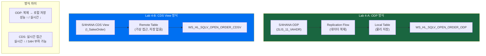
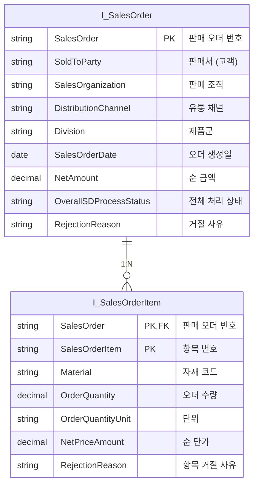
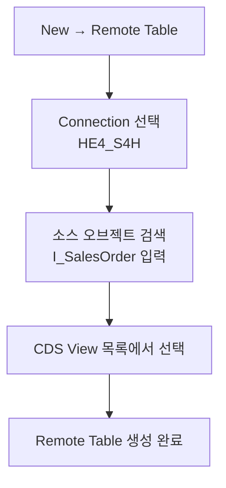
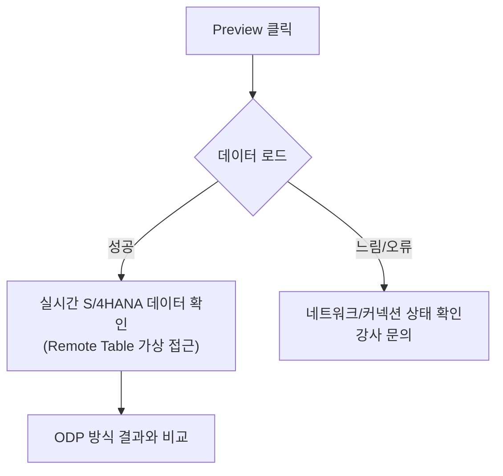
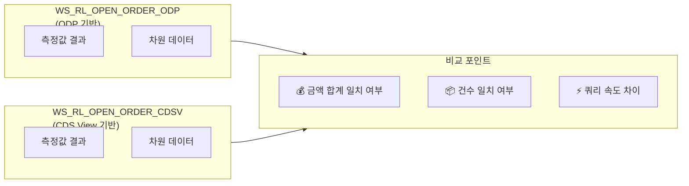
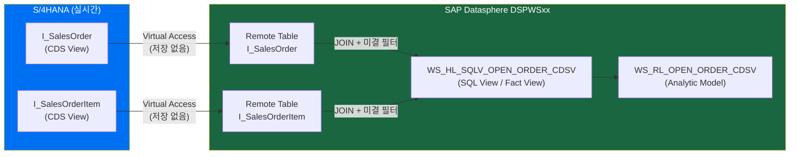
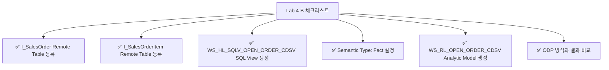
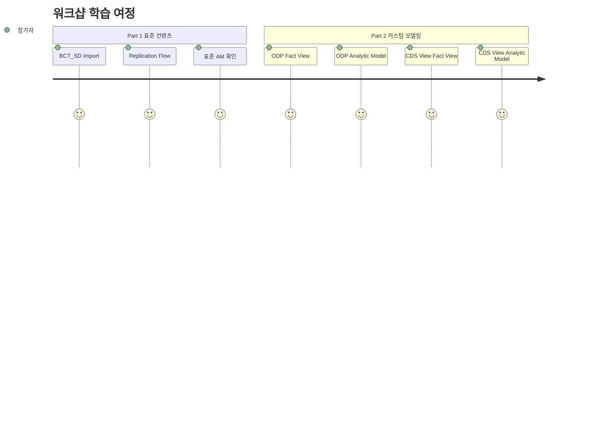

# Lab 4-B: CDS View 기반 Open Order Fact View & Analytic Model

## 목표

S/4HANA **CDS View**를 소스로 하는 Remote Table을 기반으로 **미결 판매 오더 Fact View**와 **Analytic Model**을 개발합니다.
Lab 4-A(ODP 방식)와 비교하여 두 방식의 차이를 이해합니다.

**소요 시간**: 약 60분

---

## 개발 목표 오브젝트

| 오브젝트 | ID | 설명 |
|---------|-----|------|
| SQL View (Fact View) | `WS_HL_SQLV_OPEN_ORDER_CDSV` | CDS View 기반 미결 오더 Fact View |
| Analytic Model | `WS_RL_OPEN_ORDER_CDSV` | CDS View 기반 미결 오더 분석 모델 |

---

## ODP 방식 vs CDS View 방식 비교



---

## 소스 CDS View 구조

S/4HANA의 표준 CDS View를 활용합니다:



---

## Part A. Remote Table 등록

CDS View를 Remote Table로 Datasphere에 등록합니다.

### Step A-1. Remote Table 생성

1. Data Builder → **New** 버튼 클릭
2. **Remote Table** 선택
3. Connection 선택: `HE4_S4H`



### Step A-2. I_SalesOrder Remote Table 등록

1. Connection `HE4_S4H` 선택
2. Source Object 검색: `I_SalesOrder`
3. CDS View 선택 → **Create Remote Table** 클릭

### Step A-3. I_SalesOrderItem Remote Table 등록

동일 방법으로 `I_SalesOrderItem` Remote Table 생성

> 💡 Remote Table은 S/4HANA의 데이터를 가상으로 접근합니다. 데이터를 로컬에 저장하지 않습니다.

---

## Part B. Fact View 생성

### Step B-1. SQL View 오브젝트 생성

1. Data Builder → **New** → **SQL View**
2. 기본 속성 설정:

| 속성 | 값 |
|------|-----|
| Business Name | `Open Order CDS View Fact View` |
| Technical Name | `WS_HL_SQLV_OPEN_ORDER_CDSV` |
| Semantic Type | `Fact` |

---

### Step B-2. SQL 작성

CDS View 기반 SQL:

```sql
SELECT
    -- 키 필드
    H.SALESORDER           AS VBELN,
    I.SALESORDERITEM       AS POSNR,
    -- 차원 필드 (Dimensions)
    H.SOLDTOPARTY          AS KUNNR,
    H.SALESORGANIZATION    AS VKORG,
    H.DISTRIBUTIONCHANNEL  AS VTWEG,
    H.DIVISION             AS SPART,
    H.SALESORDERDATE       AS AUDAT,
    I.MATERIAL             AS MATNR,
    I.ORDERQUANTITYUNIT    AS MEINS,
    -- 측정값 (Measures)
    H.NETAMOUNT            AS NET_AMOUNT,
    I.ORDERQUANTITY        AS ORDER_QTY,
    I.NETPRICEAMOUNT       AS NET_PRICE,
    -- 상태 필드
    H.OVERALLSDPROCESSSTATUS AS GBSTA,
    H.REJECTIONREASON      AS HDR_REASON_REJECTION,
    I.REJECTIONREASON      AS ITM_REASON_REJECTION

FROM I_SALESORDER AS H
INNER JOIN I_SALESORDERITEM AS I
    ON H.SALESORDER = I.SALESORDER

WHERE
    -- 미결 오더 필터: 완전히 처리되지 않은 오더만
    (H.OVERALLSDPROCESSSTATUS IS NULL
        OR H.OVERALLSDPROCESSSTATUS <> 'C')
    AND H.REJECTIONREASON IS NULL
    AND I.REJECTIONREASON IS NULL
```

> ⚠️ **참고**: CDS View 필드명은 ODP 필드명과 다릅니다. 위 SQL은 ODP 방식과 동일한 컬럼 구조(별칭)로 통일했습니다.

---

### Step B-3. 필드 속성 설정

Lab 4-A와 동일한 방법으로 필드 Semantic Type 설정:

| 필드 | Semantic Type |
|------|-------------|
| `VBELN` | **Key** |
| `POSNR` | **Key** |
| `KUNNR`, `VKORG`, `VTWEG`, `SPART`, `AUDAT`, `MATNR` | **Dimension** |
| `NET_AMOUNT`, `ORDER_QTY`, `NET_PRICE` | **Measure** |

---

### Step B-4. Data Preview 확인



> 💡 **성능 차이 체감**: Remote Table은 S/4HANA 쿼리 성능에 따라 Local Table보다 느릴 수 있습니다.

---

### Step B-5. 저장

**Save** 버튼 클릭하여 저장

---

## Part C. Analytic Model 생성

### Step C-1. Analytic Model 생성

1. Data Builder → **New** → **Analytic Model**
2. 기본 속성 설정:

| 속성 | 값 |
|------|-----|
| Business Name | `Open Order CDS View Analytic Model` |
| Technical Name | `WS_RL_OPEN_ORDER_CDSV` |

---

### Step C-2. Fact Source 연결

`WS_HL_SQLV_OPEN_ORDER_CDSV` 를 Fact Source로 추가

---

### Step C-3. 측정값/차원 구성

Lab 4-A (`WS_RL_OPEN_ORDER_ODP`)와 **동일한 구조**로 구성:

| 구성 요소 | 내용 |
|----------|------|
| Measures | NET_AMOUNT(SUM), ORDER_QTY(SUM), ORDER_COUNT(COUNT DISTINCT) |
| Dimensions | KUNNR, MATNR, VKORG, VTWEG, SPART, AUDAT(날짜 계층) |

> 💡 동일한 구조로 만들어 두 AM을 **비교 분석**할 수 있도록 합니다.

---

### Step C-4. 저장 및 Preview

1. **Save** 클릭
2. **Preview** 클릭하여 데이터 확인

---

## ODP vs CDS View 결과 비교

두 Analytic Model을 실행하여 결과를 비교해봅니다:



**비교 체크리스트:**

| 비교 항목 | ODP 결과 | CDS View 결과 | 일치 여부 |
|----------|---------|-------------|---------|
| 미결 오더 총 금액 | | | |
| 미결 오더 건수 | | | |
| 쿼리 응답 속도 | | | |

> 💡 데이터 복제 시점에 따라 결과가 다를 수 있습니다.

---

## 전체 흐름 정리



---

## 완료 체크리스트



---

## 워크샵 마무리 정리



### 오늘 배운 것

| 학습 내용 | 관련 Lab |
|----------|---------|
| Content Network에서 표준 패키지 Import | Lab 1 |
| Replication Flow로 S/4HANA 데이터 복제 | Lab 2 |
| Analytic Model 구조 및 데이터 분석 | Lab 3 |
| SQL View로 Fact View 개발 | Lab 4-A, 4-B |
| ODP vs CDS View 소스 방식 비교 | Lab 4-A vs 4-B |

---

## 다음 단계 (워크샵 이후)

- SAP Analytics Cloud 연결 및 대시보드 생성
- Replication Flow 증분 복제(Delta) 설정
- Data Flow로 데이터 변환 및 집계
- 추가 마스터 데이터 연결 (고객/자재 Dimension View)

---

수고하셨습니다! 🎉
